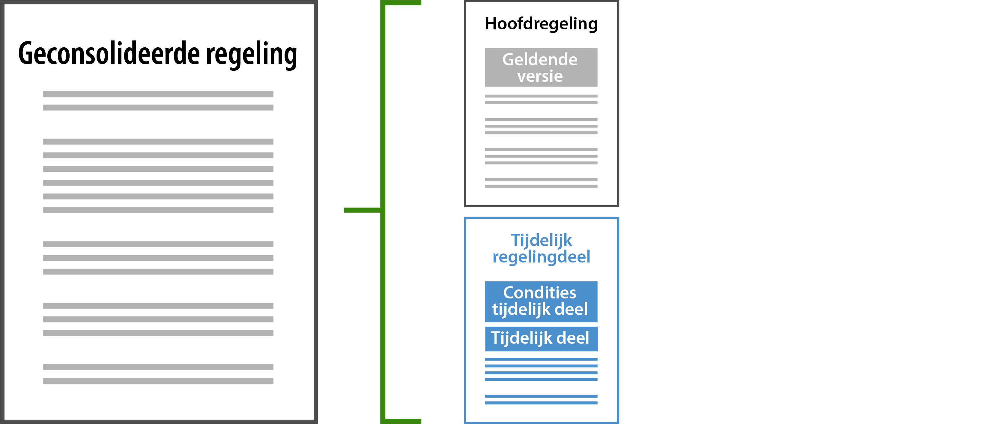
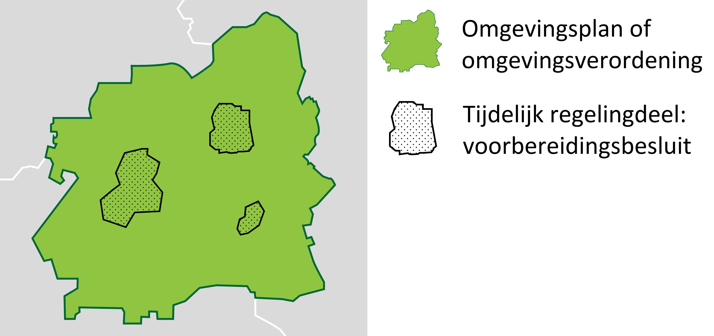

#### Wat is een voorbereidingsbesluit?

Gemeenten, provincies en Rijk kunnen een voorbereidingsbesluit nemen met het oog
op de voorbereiding van omgevingsplan, omgevingsverordening, projectbesluit,
instructieregel of instructie. Het voorbereidingsbesluit wijzigt alleen het
omgevingsplan respectievelijk de omgevingsverordening met
voorbeschermingsregels. Wanneer dat gebeurd is, dan gelden bindende regels voor
eenieder, dus ook voor burgers en bedrijven.

In aanloop naar de inwerkingtreding van bijvoorbeeld een wijziging van het
omgevingsplan kunnen op deze manier ongewenste activiteiten worden voorkomen.

Het voorbereidingsbesluit wijzigt het omgevingsplan of de omgevingsverordening
in die zin dat daarin voorbeschermingsregels worden opgenomen. De
voorbeschermingsregels staan straks dus niet meer in het voorbereidingsbesluit,
maar in het omgevingsplan of de omgevingsverordening in een zogenaamd ‘tijdelijk
regelingdeel’ dat aan de geconsolideerde regeling wordt toegevoegd. Dat ziet er
uit zoals in onderstaande afbeelding.

*Onderdelen geconsolideerde regeling: hoofdregeling en tijdelijk regelingdeel*

Het omgevingsplan of de omgevingsverordening bestaat op deze manier uit één
hoofdregeling en nul of meer tijdelijke regelingdelen. Elk deel (de
hoofdregeling en ieder tijdelijk regelingdeel) staat op zichzelf en elk deel kan
worden beheerd door een ander bevoegd gezag. Elk deel kan worden gewijzigd en
heeft dus ook zijn eigen versies.

Het tijdelijk regelingdeel is een technisch afzonderlijk deel, dat niet wordt
geconsolideerd met de hoofdregeling. Ieder tijdelijk regelingdeel kan met
wijzigingsbesluiten worden gewijzigd; dan ontstaat een consolidatie van dat
tijdelijk regelingdeel.

Er kunnen verschillende voorbereidingsbesluiten genomen worden die het
omgevingsplan of de omgevingsverordening wijzigen. Ieder voorbereidingsbesluit
wordt een afzonderlijk tijdelijk regelingdeel, ook als het betrekking heeft op
hetzelfde omgevingsplan of dezelfde omgevingsverordening, dus van dezelfde
gemeente of provincie. Op een kaartbeeld ziet dat er uit zoals in onderstaande
afbeelding.

*Schematisch weergegeven kaartbeeld tijdelijk regelingdeel*

De voorbeschermingsregels worden als tijdelijk regelingdeel toegevoegd aan het
omgevingsplan of de omgevingsverordening, dat is handig voor de burger of
bedrijf, want die hoeft voor de vraag of een ontwikkeling is toegestaan nog
slechts één document te raadplegen. Dat is dan het omgevingsplan of de
omgevingsverordening.

De voorbeschermingsregels die in het tijdelijk regelingdeel zijn opgenomen
vervallen door tijdsverloop of doordat het besluit waarop het
voorbereidingsbesluit was gericht in werking is getreden of vernietigd is. Hoe
dit precies werkt wordt nader beschreven in paragraaf 2.3 van de TPOD.
