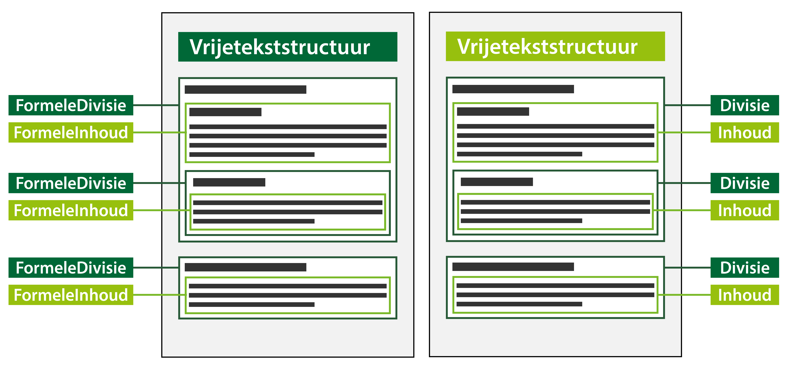

#### Tekststructuren

Er is voor inhoudelijke tekst in de instructie maar één tekststructuur mogelijk,
die met verschillende tekstelementen gevuld wordt:

-   Vrijetekststructuur: de tekststructuur die wordt gebruikt voor juridisch
    authentieke documenten waarvan het lichaam van de regeling geen artikelen
    bevat, zoals een instructie en het eerste deel van een projectbesluit.
    In dit geval worden de tekstelementen formele divisie en formele inhoud
    toegepast.  

    De vrijetekststructuur wordt ook toegepast in de overige onderdelen van de
    instructie (buiten het lichaam van de regeling), zoals de motivering van
    het besluit en de bijlagen. In die onderdelen van de
    instructie worden de tekstelementen formele divisie, formele inhoud en inhoud 
    gebruikt.

Onderstaand figuur is een conceptuele weergave van de beide varianten van de
vrijetekststructuur.

Links de vrijetekststructuur met formele divisies. Deze wordt gebruikt in het
lichaam van de instructie. Formele divisie kan een formele divisie bevatten
of formele inhoud. Formele inhoud kan geen formele divisie bevatten of formele
inhoud. Formele inhoud kan alléén voorkomen in een formele divisie.

Het rechtergedeelte van het figuur geeft de vrijetekststructuur weer, waarin de
divisies inhoud bevatten. Inhoud kan alléén voorkomen in een divisie.

*Varianten van vrijetekststructuur*
