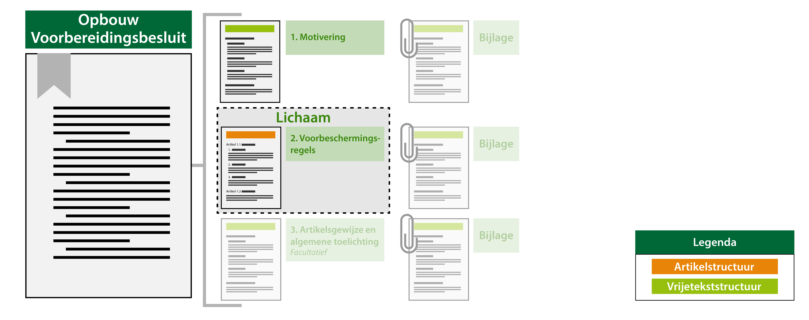

#### Besluitonderdelen en hun tekststructuur

In onderstaand figuur is per besluitonderdeel en de bijlages daarvan conceptueel
aangegeven welke tekststructuur van toepassing is. Let daarbij vooral op de
kleur van de balkjes, namelijk oranje voor de artikelstructuur en groen voor
de vrijetekststructuur. Ook zijn er onderdelen uitgegrijsd, omdat deze niet
verplicht zijn.

*Besluitonderdelen en hun tekststructuur*
