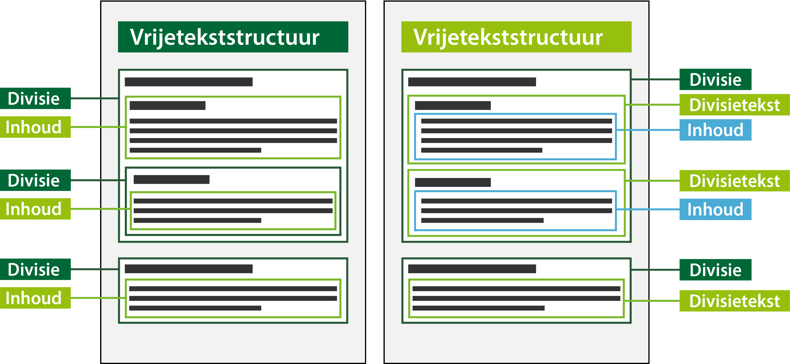

#### Tekststructuren

Er is voor inhoudelijke tekst in de omgevingsvisie één tekststructuur mogelijk, die met verschillende 
tekstelementen gevuld wordt:

-   Vrijetekststructuur: de tekststructuur die wordt gebruikt voor juridisch authentieke documenten 
    waarvan het lichaam van de regeling geen artikelen bevat.In dit geval worden de tekstelementen 
    divisie en inhoud toegepast.  

    De vrijetekststructuur wordt ook toegepast in de overige onderdelen van de omgevingsvisie 
    (buiten het lichaam van de regeling), zoals de motivering van het besluit, bijlagen en eventuele toelichting. 
    In die onderdelen van de omgevingsvisie worden de tekstelementen divisie en divisietekst (met inhoud) gebruikt.

Onderstaand figuur is een conceptuele weergave van de beide varianten van de
vrijetekststructuur.

*Varianten van vrijetekststructuur*

Links de vrijetekststructuur met divisies. Deze wordt altijd gebruikt in het lichaam van de instructie. 
Een divisie kan weer een divisie bevatten of inhoud. Inhoud kan geen divisie bevatten. 

Het rechtergedeelte van het figuur geeft de vrijetekststructuur weer, waarin de divisies divisietekst met inhoud bevatten. 

