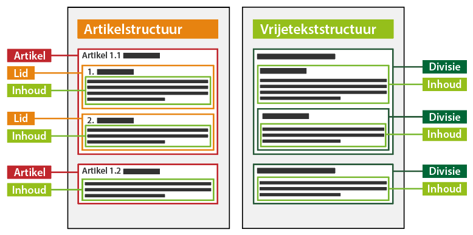

#### Tekststructuren

Er zijn voor inhoudelijke tekst twee soorten tekststructuren mogelijk:

-   Artikelstructuur: de tekststructuur waarbij het lichaam van een (formele)
    regeling is opgebouwd uit één of meer artikelen. In dit geval worden de
    tekstelementen artikel en lid toegepast.

-   Vrijetekststructuur: de tekststructuur die wordt gebruikt voor juridisch
    authentieke documenten waarvan het lichaam van de regeling geen artikelen
    bevat, zoals een omgevingsvisie en een projectbesluit.  
    Deze vrijetekststructuur wordt ook toegepast in documentdelen buiten het
    lichaam van de regeling met een artikelstructuur, zoals het motiveringsdeel
    en bijlagen. In dat geval worden de tekstelementen divisie en inhoud
    gebruikt.

Onderstaand figuur is een conceptuele weergave van de beide tekststructuren,
waarbij in dit omgevingsdocument alléén de vrijetekststructuur met divisie en
inhoud mogelijk is.

Links de artikelstructuur met artikelen en leden met inhoud. Te zien is dat
wanneer een artikel leden bevat, de inhoud in het lid voorkomt. Indien het
artikel inhoud bevat, zoals in artikel 1.2 in het figuur hieronder, is het niet
mogelijk om in dat artikel ook leden te plaatsen.

Het rechtergedeelte van het figuur geeft de vrijetekststructuur weer, waarin de
divisies inhoud bevatten. Inhoud kan alléén voorkomen in een divisie.

AFBEELDING KLOPT NIET MEER EN WORDT NOG GEWIJZIGD!!!

*Artikelstructuur en vrijetekststructuur*
