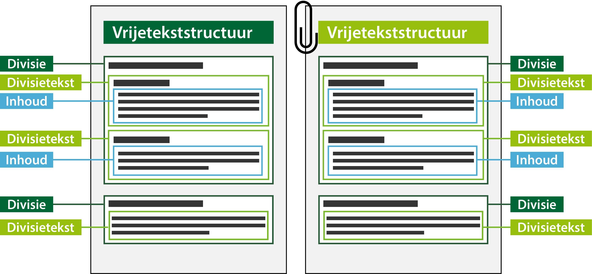

#### Tekststructuren

Er is voor inhoudelijke tekst in de instructie één tekststructuur mogelijk, die met verschillende 
tekstelementen gevuld wordt:

-   Vrijetekststructuur: de tekststructuur die wordt gebruikt voor juridisch authentieke documenten 
    waarvan het lichaam van de regeling geen artikelen bevat.In dit geval worden de tekstelementen 
    divisie, divisietekst en inhoud toegepast.  

    De vrijetekststructuur wordt ook toegepast in de overige onderdelen van de instructie, zoals de motivering 
    van het besluit en bijlagen. In die onderdelen van de instructie worden ook de tekstelementen divisie, divisietekst 
    en inhoud gebruikt.

Onderstaand figuur is een conceptuele weergave van de vrijetekststructuur.

*Model vrijetekststructuur*

Links en rechts hebben dezelfde opbouw. Links is het inhoudelijke deel van het besluit en rechts zijn zaken als motivering en bijlagen.
Een divisie kan weer een divisie bevatten of divisie tekst met daarin de inhoud. Inhoud of divisitekst kan geen divisie bevatten. 
Alleen het inhoudelijke deel (links) kan geannoteerd worden. Dit kan niet met bijlagen en dergelijke.

