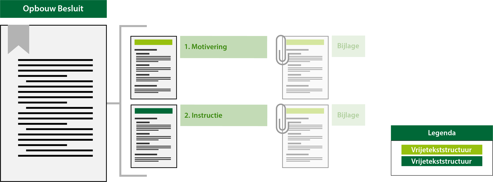

#### Besluitonderdelen en hun tekststructuur

In onderstaand figuur is per besluitonderdeel en de bijlages daarvan conceptueel aangegeven 
welke tekststructuur van toepassing is. Let daarbij vooral op de kleur van de balkjes; 
donkergroen voor de vrijetekststructuur van het lichaam van het besluit. Deze is te annoteren. 
Voor de motivering en bijlagen lichtgroen voor vrijetekststructuur buiten het lichaam van het besluit.
Deze tekststructuur is hetzelfde maar deze kun je niet annoteren. Ook zijn er onderdelen uitgegrijsd, omdat 
deze niet verplicht zijn.

*Besluitonderdelen en hun tekststructuur*

**Deel één: motivering**
Dit deel van het besluit bestaat uit de vaststellingsdocumenten en de motivering van het
besluit tot vaststelling c.q. wijziging van de instructie.
Dit deel begint met de vaststellingsdocumenten: de overwegingen van het bestuur die leiden
tot het nemen van het besluit. Daarna volgt de motivering: de inhoudelijke onderbouwing
van het besluit. In het geval van een wijzigingsbesluit wordt in dit deel onder andere
beschreven op welke onderdelen de instructie wordt aangepast en waarom.
Indien gewenst kunnen bijlagen met onderzoeksgegevens en bescheiden bij dit eerste deel
van het vaststellingsbesluit gevoegd zijn.

**Deel twee: instructie**
Dit deel van het besluit is de instructie zelf. Hierin staat de opdracht aan het bestuursorgaan
tot het uitoefenen van een taak of bevoegdheid en de daarbij behorende Locatie of Locaties.
Indien nodig kunnen ook bij dit tweede deel bijlagen worden gevoegd.
In het geval van een wijzigingsbesluit wordt in dit deel concreet aangegeven op welke wijze
de instructie wordt aangepast. Aangegeven wordt welke onderdelen aan het initiële besluit
worden toegevoegd, geschrapt, gewijzigd of vervangen door andere. Bij een wijzigingsbesluit
wordt dit deel weergegeven in ‘renvooiweergave’; een weergave waarin met visuele
middelen wordt duidelijk gemaakt wat wordt toegevoegd of geschrapt.