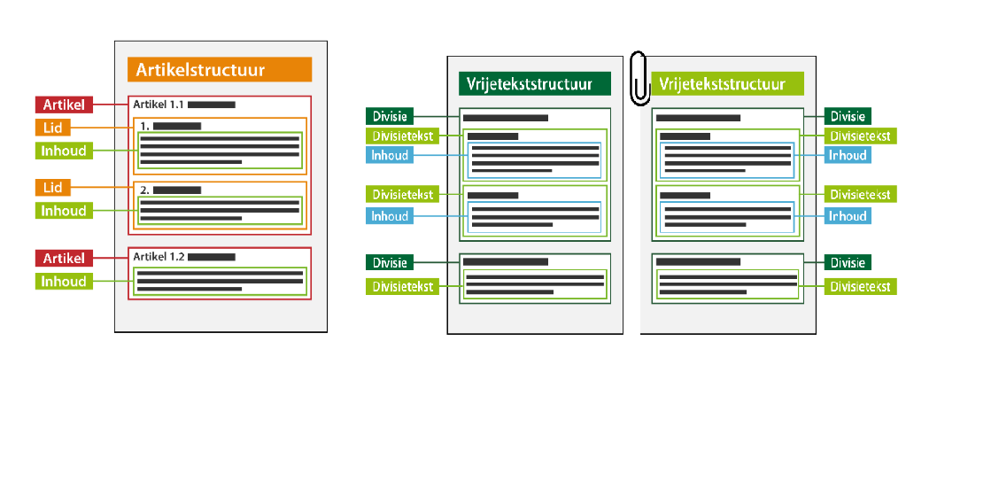

#### Tekststructuren

Er zijn voor inhoudelijke tekst twee soorten tekststructuren mogelijk:

-   Artikelstructuur: de tekststructuur waarbij het lichaam van een (formele) regeling is opgebouwd 
    uit één of meer artikelen. In dit geval worden de tekstelementen artikel en lid toegepast.

-   Vrijetekststructuur: de tekststructuur die wordt gebruikt voor juridisch authentieke documenten 
    waarvan het lichaam van de regeling geen artikelen bevat, zoals in dit geval het eerste deel van 
    de reactieve interventie. In dit geval worden de tekstelementen divisie en  inhoud toegepast.  

    De vrijetekststructuur wordt ook toegepast in de overige onderdelen van de reactieve interventie (buiten het lichaam van de regeling)
    zoals de motivering van het besluit en bijlagen. In die onderdelen van het reactieve interventie worden de 
    tekstelementen divisie en divisietekst (met inhoud) gebruikt.

Onderstaand figuur is een conceptuele weergave van de beide tekststructuren.

 

*Artikelstructuur en vrijetekststructuur*

Links de artikelstructuur met artikelen en leden met inhoud. Te zien is dat wanneer een artikel leden bevat, de inhoud in het lid voorkomt. 
Indien het artikel inhoud bevat, zoals in artikel 1.2 in het figuur hierboven is het niet mogelijk om in dat artikel ook leden te plaatsen. 
Deze structuur is alléén van toepassing op deel 2 van de reactieve interventie.

Het rechtergedeelte van het figuur geeft de vrijetekststructuur weer, waarin de divisies minstens divisietekst met inhoud bevatten. De inhoud 
valt altijd binnen een divisietekst. Een divisie kan een divisie bevatten of inhoud. Inhoud kan geen divisie bevatten. 

