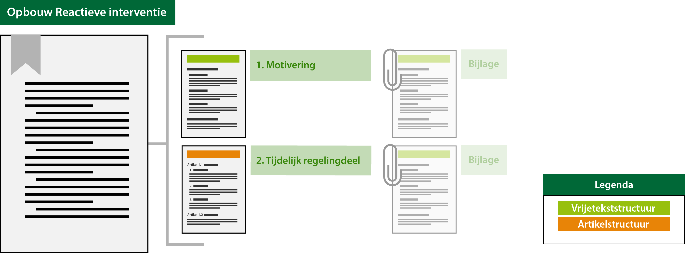

#### Besluitonderdelen en hun tekststructuur

In onderstaand figuur is per besluitonderdeel en de bijlages daarvan conceptueel aangegeven 
welke tekststructuur van toepassing is. Let daarbij vooral op de kleur van de balkjes. 
Oranje voor de artikelstructuur van het lichaam van het besluit ofwel het tijdelijk regelingdeel 
van de reactieve interventie. 
Voor de motivering en bijlagen lichtgroen voor vrijetekststructuur buiten het lichaam van het besluit.
Deze tekststructuur is anders en deze kun je niet annoteren. Ook zijn er onderdelen "uitgegrijsd"
omdat deze facultatief zijn.

 

*Besluitonderdelen en hun tekststructuur*

**Deel één: motivering**
Dit deel van het besluit bestaat uit de vaststellingsdocumenten en de motivering van het
besluit tot vaststelling c.q. wijziging van de reactieve interventie. Deze is in vrije 
tekststructuur en niet te annoteren.

**Deel twee: tijdelijk regelingdeel**
Dit is het tijdelijk regelingdeel met daarin een tekstblok met condities en het reactieve
interventie deel zelf. Het tijdelijk regelingdeel is in de artikelstructuur en derhalve
ook te annoteren. 
Indien nodig kunnen ook bij dit tweede deel bijlagen worden gevoegd. De bijlagen zijn wel 
in vrijetekststructuur en niet te annoteren.

In het geval van een wijzigingsbesluit wordt in dit deel concreet aangegeven op welke wijze
de reactieve interventie wordt aangepast. Aangegeven wordt welke onderdelen aan het initiële 
besluit worden toegevoegd, geschrapt, gewijzigd of vervangen door andere. Bij een wijzigingsbesluit
wordt dit deel weergegeven in ‘renvooiweergave’. Dit is een weergave waarin met visuele
middelen wordt duidelijk gemaakt wat wordt toegevoegd of geschrapt.