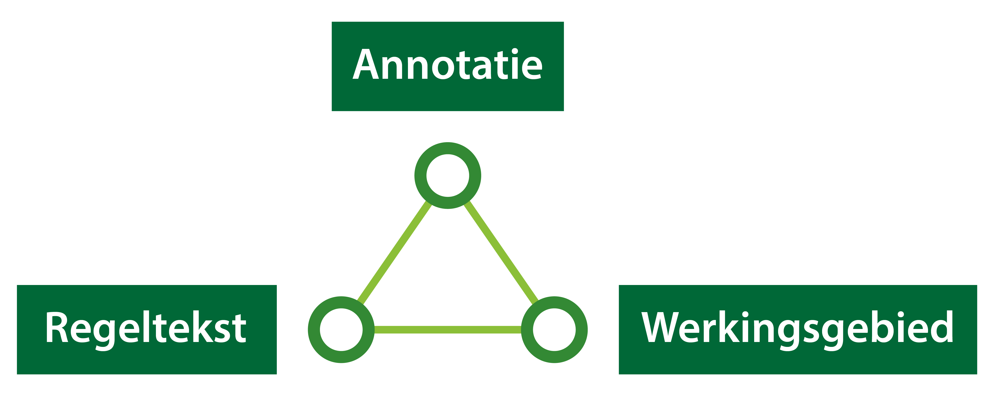

#### Opbouw van de regels 

Het bevoegd gezag heeft de mogelijkheid om diverse soorten regels op te stellen
over activiteiten die gevolgen (kunnen) hebben voor de fysieke leefomgeving. Om
de regels in het Digitale Stelsel Omgevingswet te laten landen, is in de
STOP/TPOD uitgewerkt hoe deze zowel mens- als machineleesbaar worden gemaakt.

Om de regels in het Digitale Stelsel Omgevingswet te laten landen bestaan deze
uit verschillende onderdelen.

*Onderdelen van regels*

Over het algemeen kan gezegd worden dat de regeltekst uit een (of meerdere)
juridische regel bestaat die aangeeft ‘wat’ er geldt. Daarnaast heeft een
regeltekst een werkingsgebied die aangeeft ‘waar’ dit geldt. Tot slot kan een
regeltekst voorzien worden van extra informatie die aangeeft ‘waarover’ de
regeltekst gaat, door middel van annoteren.

In dit deel van de praktijkrichtlijn lees je meer over deze onderdelen van de regels.