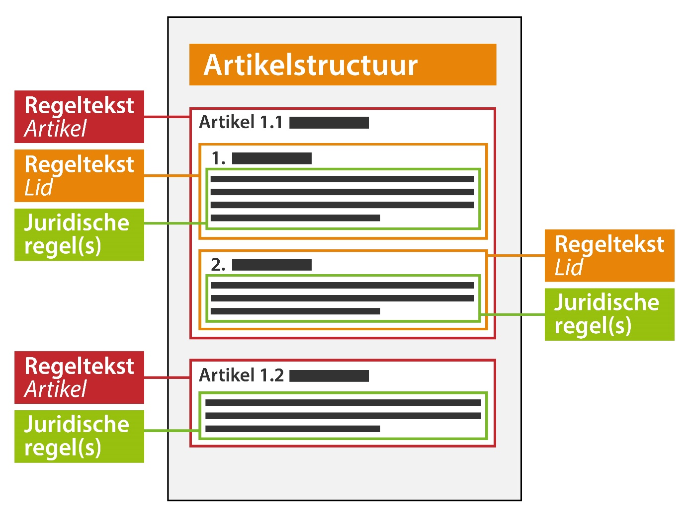

#### Regeltekst en juridische regel

Zoals rechtsboven in *2. Besluitonderdelen en tekstmodel* is uitgewerkt, bestaat een omgevingsdocument 
uit tekstelementen. Binnen de tekstelementen zijn informatiekundige elementen aangewezen waaraan informatie 
gekoppeld kan worden. In omgevingsdocumenten met een artikelstructuur (zoals dit omgevingsdocument) is
dit de regeltekst.

**Regeltekst** is de kleinste zelfstandige eenheid van (een of meer) bij elkaar horende juridische 
regels: een artikel en lid. Een artikel is altijd een regeltekst. Indien het artikel leden bevat, 
dan zijn de losse leden óók regeltekst. De regeltekst is in een tekst concreet aan te wijzen. Meer 
informatie over regeltekst vind je in *paragraaf 6.2.1.1 van de TPOD.*

**Juridische regel** is een abstract concept dat een regel met juridische werkingskracht beschrijft, ofwel
welke regel er juridisch  geldig is. Juridische regel wordt gebruikt om aan verschillende onderdelen van 
een Regeltekst locaties en inhoudelijke annotaties te kunnen koppelen.
Een juridische regel is ook altijd onderdeel van een regeltekst. Een regeltekst kan dan weer een of meerdere 
juridische regels bevatten. 

*Conceptuele weergave van de juridische regels en regeltekst*

Bij bevraging in bijvoorbeeld DSO-LV zal altijd de volledige regeltekst als resultaat worden weergegeven 
en niet de individuele juridische regel. Dat komt omdat de context van een regel ook altijd duidelijk moet zijn. 
Om de regels te kunnen bevragen op de kaart in DSO-LV moet er een locatie gekoppeld worden aan de regeltekst. 
Het koppelen van een locatie aan de regeltekst is verplicht. Bij een klik op de kaart op een betreffende locatie
komt de regel over een bepaald werkingsgebied naar voren. 

Het **werkingsgebied** is een abstract, conceptueel begrip: het gebied waar een Regeltekst zijn werking heeft. Het begrip 
werkingsgebied wordt in de STOP-standaard gebruikt voor de computerleesbare verbinding tussen een regeltekst en de geografische
informatieobjecten (GIO's).

Op de volgende pagina of bij het onderwerp Locatie en werkingsgebied vind je uitleg over Locaties en werkingsgebieden.

Verder is het mogelijk om de regeltekst te annoteren. Annoteren is noodzakelijk om het bevragen van de regels in DSO-LV 
mogelijk te maken. Ook is het annoteren nodig om de regels op een betekenisvolle manier te verbeelden op de kaart in DSO-LV. 
Meer informatie over annoteren in relatie tot presenteren vind je in paragraaf 2.1 van het [presentatiemodel](https://geonovum.github.io/TPOD/Presentatiemodel/Presentatiemodel%20TPOD%20v1.0.pdf).
