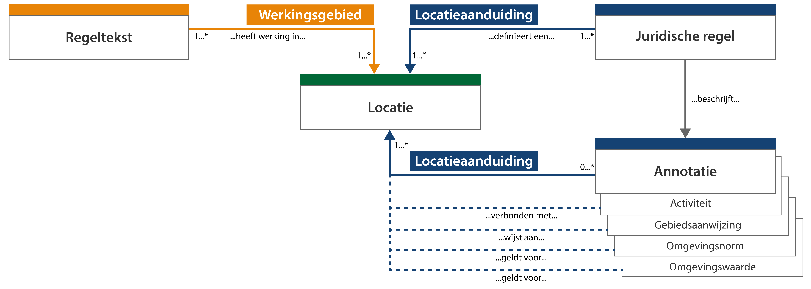
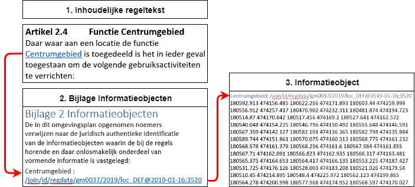

#### Locatie en werkingsgebied in context

Uitgangspunt van STOP is dat ieder artikel en lid een werkingsgebied heeft. Zoals
op de vorige pagina is aangegeven bevat de regeltekst ten minste één juridische
regel, maar kan deze ook meerdere juridische regels bevatten. De juridische regel
(als IMOW-object) is een conceptuele constructie die noodzakelijk is om
verschillende onderdelen van de regeltekst een eigen locatie te kunnen geven.

Locatie bevat meestal een gebied of een groep van gebieden (gebiedengroep), maar
kan ook een punt of een lijn, respectievelijk een puntengroep of een lijnengroep
zijn. Elk van deze entiteiten bevat een geometrie. Het werkingsgebied is een
optelling van de locaties van alle juridische regels, die samen de regeltekst
vormen. Het werkingsgebied geeft de geometrische afbakening aan waar een
regeltekst (dus een artikel of een lid) zijn werking heeft.

Om de termen locatie en werkingsgebied en hun onderlinge relatie goed te kunnen
duiden, is een toelichting nodig op begrippen die met deze twee termen van doen
hebben. In onderstaand figuur zijn deze begrippen in vereenvoudigde weergave
met elkaar in verband gebracht.

*Conceptuele weergave van locatie en werkingsgebied en de relatie met andere
relevante begrippen*

In de gepresenteerde samenhang van de begrippen wordt duidelijk dat een locatie
op drie manieren kan worden ‘aangeroepen’:

-   als werkingsgebied van een regeltekst;

-   als locatieaanduiding van een juridische regel;

-   als locatieaanduiding van een van de annotaties activiteit, omgevingswaarde, omgevingsnorm en gebiedsaanwijzing.

Het werkingsgebied is daarbij een IMOP-attribuut van het artikel en lid, terwijl de
locatieaanduiding een IMOW-attribuut is van een juridische regel of een
inhoudelijke annotatie. Bovengenoemde annotaties zijn ook IMOW-objecten. 
Op de volgende pagina is aangegeven welke annotaties in het omgevingsdocument gebruikt kunnen worden.

De juridische regel *definieert* de locatie door middel van de
locatieaanduiding. De annotatie (met IMOW-object) verwijst naar de locatie die door 
de relevante juridische regel(s) gedefinieerd wordt. In principe geldt dat de locatie van zo'n
annotatie gelijk moet zijn aan de locatieaanduiding van de
juridische regel, en gelegen moet zijn binnen het werkingsgebied van de regeltekst waarin de juridische regel is opgenomen.

**Geografisch informatieobject en noemer**

De geometrische begrenzing van een werkingsgebied, en dus van de locatie(s), kan
niet in tekstuele vorm voor de mens leesbaar weergegeven worden. Het is een
lijst van coördinaten, met extra gegevens zoals bijvoorbeeld ook de hoogte. De
locaties, die samen het werkingsgebied vormen, worden daarom vastgelegd in een
geografisch informatieobject (GIO). Een GIO is een informatieobject met ten
minste één geometrie. Naast geometrie kan een GIO ook
waarden bevatten, zoals waarden voor omgevingsnormen. STOP gebruikt het
informatieobject als bedoeld in Aanwijzing 3.50 van de Aanwijzingen voor de
regelgeving om dergelijke informatie op een juridisch juiste manier vast te
leggen en er vanuit een besluit naar te verwijzen. Een informatieobject kan door 
meerdere regelingen en/of besluiten worden gebruikt. Lees meer over de noemer en
het informatieobject in paragraaf 6.2.2 van de TPOD.

Om vanuit de tekst van het omgevingsdocument op een juridisch juiste manier te
verwijzen naar het GIO, heeft het GIO één noemer. Een noemer is een naam die in
de tekst opgenomen wordt en waaruit de lezer kan begrijpen waar het
(geografisch) informatieobject betrekking op heeft. De noemer is een verplicht
onderdeel van de inhoud van het informatieobject. Door deze noemer in de tekst
van het besluit op te nemen, worden de tekst en het juridisch vastgestelde
informatieobject met elkaar verbonden en wordt het de lezer duidelijk gemaakt
dat het informatieobject ook onderdeel uitmaakt van het besluit.

De noemer op zichzelf is onvoldoende identificerend voor een informatieobject en
moet altijd vergezeld worden van de volledige identificatie van het
informatieobject. Dat hoeft niet op de plaats waar de noemer in de tekst
gebruikt wordt, de noemer met de bijbehorende identificatie mag ook in een bijlage opgenomen worden. In STOP wordt de noemer van een informatieobject binnen de tekst
van een regeling opgevat als een lokaal begrip, die in een bijlage opgenomen kan
worden. Met de noemer en de unieke identificatie kan de verwijzing vanuit de
tekst gerealiseerd worden, waardoor het geografisch informatieobject een
juridische status krijgt.

Tot slot is de noemer ook een attribuut van locatie, zodat ook duidelijk is dat
de tekst en de locatie bij elkaar horen.

De noemer komt dus voor:

-   In de tekst;

-   In het geografisch informatieobject;

-   In de bijlage in combinatie met de volledige identificatie van het
    informatieobject;

-   In de locatie (IMOW).

Onderstaand figuur geeft een voorbeeld van hoe de noemer eruit ziet, beschouwd
vanuit de tekst, de bijlage en het informatieobject. Daarnaast is de noemer ook 
één van de attributen van locatie (IMOW-object).

*Noemer in de tekst, de bijlage en het informatieobject*

**Waarom een locatie en altijd een werkingsgebied?**

Ten behoeve van de informatieverschaffing in het LVBB en het DSO-LV kan door
middel van een locatie en werkingsgebied op eenvoudige wijze duidelijk worden
gemaakt waar regelteksten hun werking hebben. Het moet voor de wet altijd
duidelijk zijn waar een artikel en lid werking hebben, vandaar de verplichting voor een
werkingsgebied. Daarnaast heeft het DSO-LV locaties nodig om het omgevingsloket
te laten functioneren. Zonder locaties werkt het DSO-LV niet.

Op officielebekendmakingen.nl, worden de besluiten met authentieke tekst
weergegeven met aparte landingspagina’s voor de (geografische)
informatieobjecten. Per regeltekst is zo inzichtelijk welke GIO’s ermee
verbonden zijn en kan iedere GIO afzonderlijk getoond worden in een viewer. Dit
is een documentgerichte weergave van één regeling, dus niet van meerdere bevoegde
gezagen.

In het Omgevingsloket komen de IMOW-objecten van alle bevoegd gezagen samen en
worden deze gecombineerd met de regelteksten uit de geconsolideerde regelingen
vanuit officiële publicaties. Met een klik op de kaart zijn de daar geldende
regels te raadplegen. De locaties uit de diverse regelgeving worden via een
legenda gesymboliseerd op de kaart. De regels en kaart geven ook
selectiemogelijkheden, bijvoorbeeld het tonen van regeltekst en locaties voor
een specifieke activiteit of het uitsluitend tonen van regels die voor iedereen
gelden. De getoonde regels komen uit de geconsolideerde regelingen vanuit de
officiële publicatiebladen. Om het Omgevingsloket te laten functioneren is het
noodzakelijk dat locaties gebruikt worden en dat juridische regels geannoteerd
worden.
