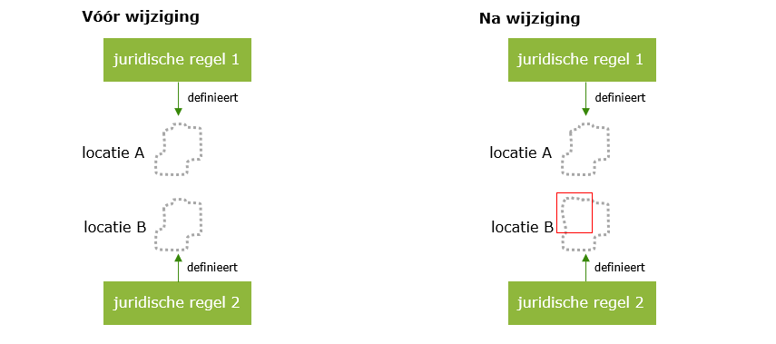

#### Locatie en juridische regel als aparte objecten

Informatiekundig worden juridische regel en locatie als twee aparte objecten
gezien. Dit maakt het mogelijk om dezelfde locatie te gebruiken in verschillende
regels en in bijvoorbeeld verschillende activiteiten, mits bewust dezelfde
locatie wordt bedoeld. Het kan ook voorkomen dat vanuit de ene juridische regel
de begrenzing exact gehanteerd moet worden, terwijl deze vanuit een andere
juridische regel als indicatief moet worden gezien (middels idealisatie). Beide juridische regels
kunnen dan verwijzen naar dezelfde locatie en een verschillende idealisatie
hebben.

Wanneer een locatie wijzigt, bijvoorbeeld als de geometrie verandert of een
nieuw gebied wordt toegevoegd, dan wijzigt de juridische regel op zichzelf niet.
De juridische regel bevat immers alleen een verwijzing naar een locatie. Wanneer
deze twee objecten in samenhang met elkaar wijzigen, wijzigt de juridische regel
uiteraard wel.

Het is ook mogelijk om juist aparte locaties te gebruiken die een gelijke
geometrische afbakening kennen. Dit kan nodig zijn wanneer de geometrische
afbakening van een juridische regel juist niet mee mag veranderen als de locatie
hiervan moet wijzigen vanuit een andere juridische regel. In dit geval moeten beide
locaties een eigen (logische) noemer krijgen. Zie hieronder het voorbeeld
waar locatie A en B voor de wijziging dezelfde geometrische afbakening hebben.
Na de wijziging is locatie B aangepast en heeft dat dus alleen invloed op de locatieaanduiding van 
juridische regel 2. 

*Voorbeeld van aparte locaties met dezelfde geometrische afbakening voor de wijziging*

Zo kunnen er bijvoorbeeld vijf verschillende juridische regels tegelijkertijd
geldig zijn, op evenzoveel geometrisch afgebakende locaties, waarbij de locaties
exact dezelfde geometrie hebben en geïnspireerd zijn op exact dezelfde fysieke
locatie.
