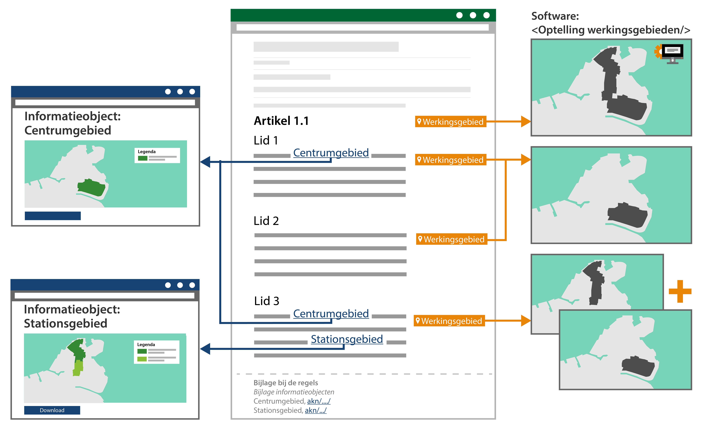
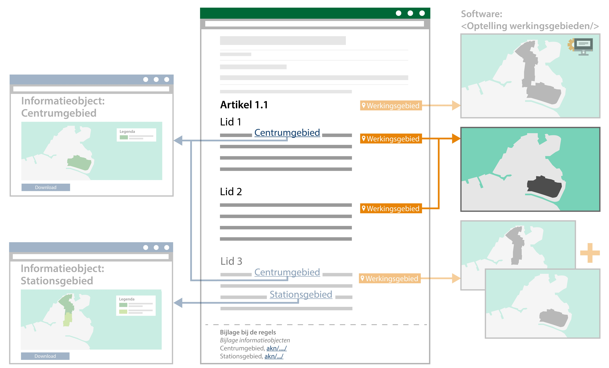

#### Voorbeelden

In de alinea’s hieronder zijn verschillende voorbeelden uitgewerkt waar het
principe van de STOP/TPOD is toegepast op de scenario’s. Het is uiteindelijk aan
het bevoegd gezag om een afweging te maken bij het opstellen van de regeltekst
of het wenselijk is om met meerdere juridische regels in één regeltekst te werken zodat afzonderlijke
delen van de regeltekst een eigen locatie hebben. Het is ook mogelijk om de
regeltekst zo op te stellen dat je maar één juridische regel per regeltekst hebt.
In dat geval heeft de regeltekst werking in exact dezelfde locatie als die door 
die ene juridische regel gedefinieerd wordt.

**Regeltekst met één juridische regel en één locatie**

In onderstaand voorbeeld bevat de regeltekst één juridische regel met één
verwijzing naar één locatie. In zo’n geval kan de regeltekst bijvoorbeeld als volgt luiden:

>   Ter plaatse van het gebied van de functie *Bedrijf categorie 2* mogen de
>   locatie en de daarop voorkomende bouwwerken worden gebruikt voor het
>   exploiteren van een bedrijf.

Wanneer de locatie is vastgelegd in een geografisch informatieobject en er met
een noemer vanuit de tekst naar verwezen wordt, maakt dat ‘Bedrijf categorie 2’
het werkingsgebied van deze regeltekst is. In de IMOW-bestanden zal de locatie
ook voorzien zijn van dezelfde noemer. Daarnaast zal in de IMOW-bestanden te
zien zijn dat de juridische regel de locatie definieert en ook de
gebiedsaanwijzing (van het type ‘functie’) en de activiteit verbonden zijn met
die locatie.

**Regeltekst bevat meerdere juridische regels en meerdere locaties**

In onderstaande figuur is in lid 1 sprake van een regeltekst die één juridische
regel met één locatie (‘Centrumgebied’) bevat. Dit is eenzelfde voorbeeld als
hierboven.

*Conceptuele weergave van regelteksten met bijbehorende geografische
informatieobjecten en werkingsgebieden*

In lid 3 is een voorbeeld uitgewerkt van een regeltekst die meerdere juridische
regels bevat met meerdere locaties. In zo’n geval kan de regeltekst bijvoorbeeld
als volgt luiden:

>   In het *centrumgebied* en in het *stationsgebied* is het toegestaan om
>   zonder vergunning of melding een horeca-inrichting te exploiteren.

In dit voorbeeld zijn er twee locaties en derhalve twee geografische
informatieobjecten die bij de bekendmaking c.q. publicatie vastgelegd en
aangeleverd worden: 'het centrumgebied' en 'het stationsgebied'. De twee
locaties tezamen vormen het werkingsgebied van de regeltekst, want het
werkingsgebied van de regeltekst is dan de optelling van de locaties van alle
juridische regels die samen de regeltekst vormen. Het werkingsgebied van de
regeltekst van lid 3 is dus het ‘Centrumgebied’ én ‘Stationsgebied’ gezamenlijk.

**Werkingsgebied zonder noemer**

Wanneer er op een andere plek in het omgevingsdocument een werkingsgebied
vastgelegd is (met een noemer en een unieke identificatie voor GIO), kan het
voorkomen dat dit niet in de tekst van de regeltekst herhaald wordt. Het is dan mogelijk om,
door middel van de software, alsnog de regeltekst te koppelen aan het gewenste
werkingsgebied. De regeltekst blijft daarmee bevraagbaar via de kaart op dat
werkingsgebied, zonder dat de lezer van de regeltekst in dat specifieke stuk
regeltekst kan zien dat het gekoppeld is. De lezer zal het wel moeten kunnen
interpreteren, bijvoorbeeld doordat het in dat hoofdstuk of artikel wel
beschreven is.

In onderstaande figuur is in lid 2 een voorbeeld geïllustreerd van een
regeltekst waarbij niet expliciet een werkingsgebied is benoemd in de tekst.

*Conceptuele weergave van werkingsgebied zonder noemer in de juridische regel*

De standaard vereist dat een werkingsgebied aan een regeltekst gekoppeld wordt.
Dat hoeft niet te betekenen dat een mens dat altijd handmatig hoeft te doen. De
software kan die taak gemakkelijker maken, bijvoorbeeld door werkingsgebieden
aan grotere delen van de tekst te koppelen (mits dat juridisch juist is). In dit
voorbeeld heeft de software de regeltekst aan het werkingsgebied van de voorgaande
regeltekst gekoppeld. In dit voorbeeld is dat het 'Centrumgebied' uit lid 1.

Het werkingsgebied geeft de geometrische afbakening aan waar een regeltekst zijn
juridische werking heeft. Het is wel aan de lezer van de regeltekst om te
interpreteren waar, binnen deze geometrische afbakening, de regeltekst wel en
niet zijn werking heeft.

**Werkingsgebied en interpretatie**

Een regeltekst kan bijvoorbeeld als volgt luiden:

>   In de *stad Amersfoort* mag binnen een afstand van 300 meter rondom een
>   school of kinderopvanglocatie geen coffeeshop worden gevestigd.

Het werkingsgebied kan dan geometrisch worden afgebakend met de grens van de
stad Amersfoort. Het wil echter niet zeggen dat nergens in Amersfoort een
coffeeshop mag worden gevestigd. Dat kan volgens deze regel wel, mits buiten de
afstand van 300 meter van een school of kinderopvanglocatie. Het is aan de lezer
om de inhoud van de regeltekst te interpreteren.
