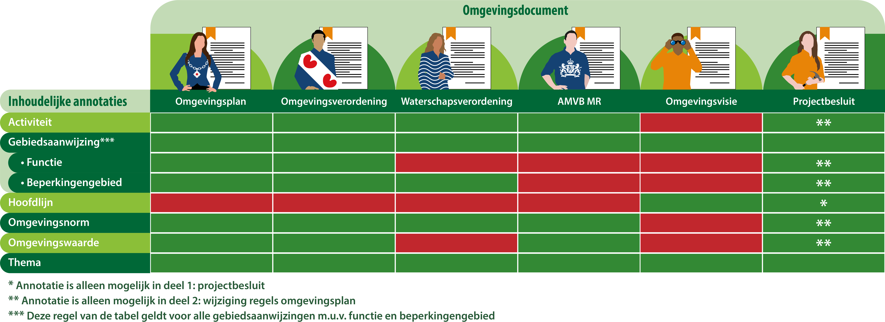
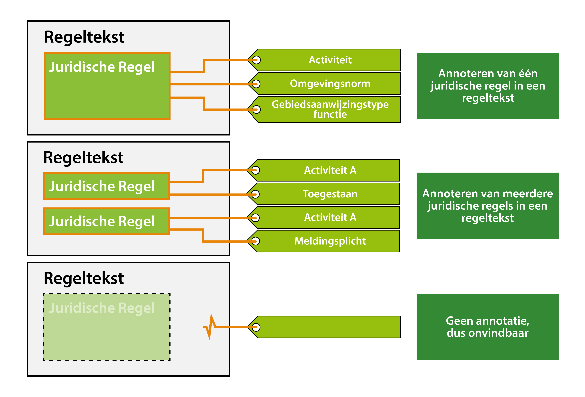

#### Toepassen van annoteren

In de TPOD is gespecificeerd van welke annotatie mogelijkheden er gebruik
gemaakt kan worden volgens IMOW. In onderstaande tabel is voor de inhoudelijke
annotaties uitgewerkt welke van toepassing zijn in welke omgevingsdocumenten.
Toelichting op de kleurgebruik in de tabel:

Groen= Annotatie is van toepassing

Rood= Annotatie is niet van toepassing

*Annotatiemogelijkheden per omgevingsdocument*

In de TPOD van het specifieke omgevingsdocument is in elke paragraaf 6.4 nader
uitgewerkt wat deze annotaties omvatten en welke typen en attributen ze hebben.
Ook is in de TPOD aangegeven welke regels er gelden voor het gebruik van de
annotatie. Het is niet de bedoeling om in deze praktijkrichtlijn volledig alle
annotaties uit te werken, maar om meer uitwerking te geven aan hoe die
annotaties in de praktijk gaan werken.

Een juridische regel kun je annoteren met een (of meerdere) van bovenstaande
inhoudelijke annotaties. De regeltekst bevat de juridische regel(s). In
technische zin zal een annotatie gekoppeld worden op het niveau van de
regeltekst.

*Annoteren juridische regel*

In het DSO-LV zal bij bevraging wel het gehele artikel met leden getoond worden,
zodat de gebruiker de juridische regels in de juiste en volledige context kan
interpreteren. Als een juridische regel niet wordt geannoteerd, dan is deze ook
niet vindbaar in het DSO-LV. Zie bovenstaande figuur voor een schematische
weergave.