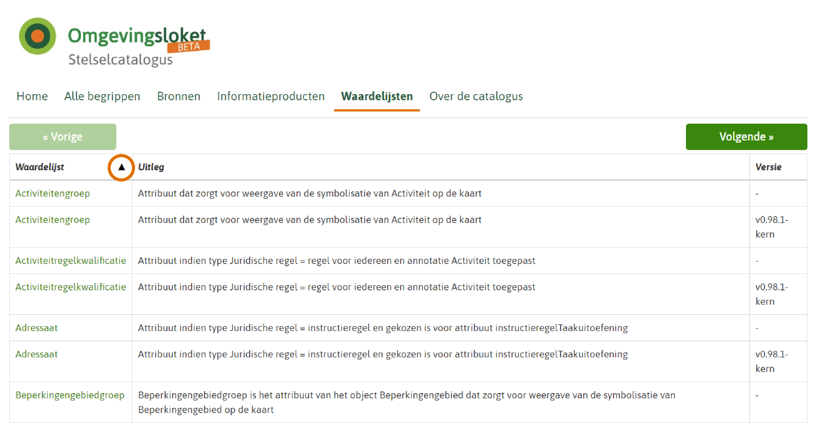

#### Beheer waardelijsten

De waardelijsten en individuele waarden binnen de waardelijsten zijn geen
onderdeel van het informatiemodel omgevingswet (IMOW). In het IMOW is bij de
relevante attributen aangegeven dat er sprake is van een waardelijst (codelist)
en wat de naam is van de waardelijst. De waardelijsten zelf zijn toegankelijk
via de [stelselcatalogus
Omgevingswet](https://stelselcatalogus.omgevingswet.overheid.nl/waardelijstenpagina).
Hierin zijn de namen van de waardelijsten uit de TPOD overgenomen met een
toelichting en versie.

Bij het raadplegen van de stelselcatalogus moet er goed gekeken worden naar de
meest actuele versie. Door linksboven op de pijltjes te klikken wordt de tabel
alfabetisch gesorteerd en staan de verschillende versies van de waardelijst
onder elkaar. Zie de rode cirkel in onderstaand figuur.

