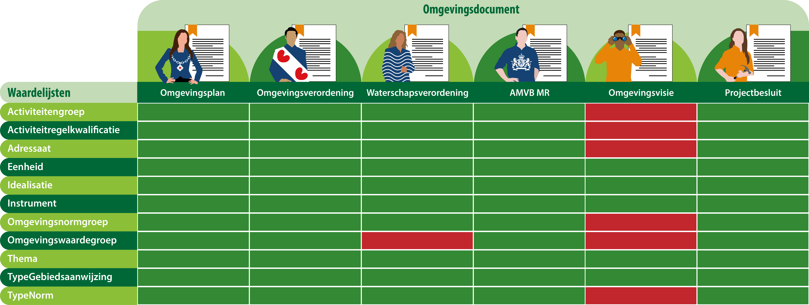

#### In welk omgevingsdocument komt welke waardelijst voor?

Niet alle waardelijsten zijn voor alle omgevingsdocumenten van toepassing. Welke waardelijsten in welk omgevingsdocument
gebruikt kunnen worden, hangt af van welke annotaties er in een omgevingsdocument mogelijk zijn.

Hieronder vind je een overzicht welke waardelijsten voor welk omgevingsdocument van toepassing zijn.

In de TPOD is in paragraaf 6.4 beschreven hoe je kunt annoteren met de IMOW objecten. Per object is beschreven of deze 
van toepassing is in het betreffende omgevingsdocument en welke attributen deze heeft. Ook is beschreven of het
attribuut een vrij veld is, of dat deze uit een limitatieve of uitbreidbare waardelijst gekozen moet worden. 
Als het attribuut alleen uit een waardelijst gekozen kan worden, is bij het attribuut beschreven wat de naam van de
betreffende waardelijst is. Een voorbeeld van een vrij veld is de naam van de activiteit. De activiteitengroep en de 
activiteitregelkwalificatie moeten echter wel uit een (limitatieve) waardelijst gekozen worden en liggen dus vast.

De lijst van mogelijke waarden staat in de stelselcatalogus waar de plansoftware van bevoegd gezag mee kan koppelen.
