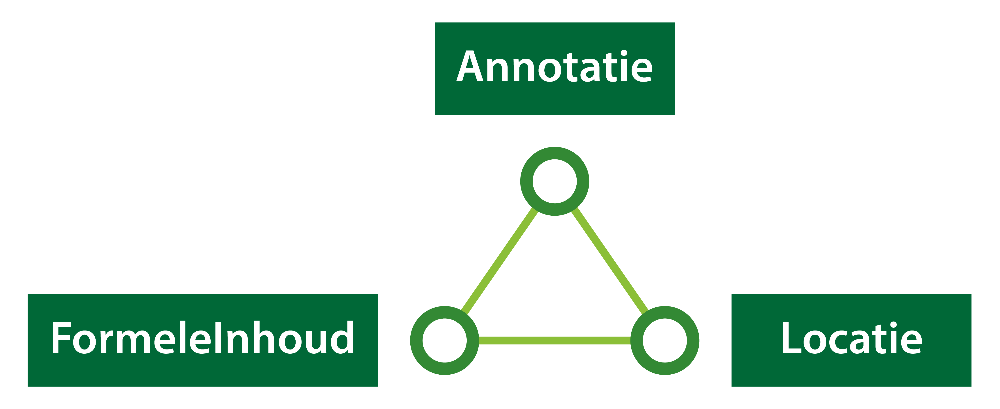

#### Opbouw van de beleidstekst

Het bevoegd gezag heeft de mogelijkheid om in de Omgevingsvisie beleidstekst op
te stellen die iets zegt over het beleid met betrekking tot de fysieke
leefomgeving. Om de beleidstekst in het Digitale Stelsel Omgevingswet te laten
landen, is in de STOP/TPOD uitgewerkt hoe deze zowel mens- als machineleesbaar
kan worden gemaakt.

Zoals rechtsboven in *2. Besluitonderdelen en tekstmodel* is uitgewerkt, bestaat
een omgevingsdocument uit structuurelementen. Binnen de structuurelementen zijn
informatiekundige elementen aangewezen waaraan informatie gekoppeld kan worden.
In de Omgevingsvisie is dit de formele inhoud.

De formele inhoud is het structuurelement in het lichaam van de regeling dat de
juridische inhoud bevat. In de Omgevingsvisie is de beleidstekst de juridische
inhoud die in de formele inhoud staat. Formele inhoud kan alleen voorkomen in een
formele divisie.

Om de beleidstekst in het Digitale Stelsel Omgevingswet te laten landen bestaat
deze uit verschillende onderdelen.

*Onderdelen van beleidstekst*

De formele inhoud is het structuurelement dat aangeeft ‘wat’ er geldt. De
formele inhoud is gekoppeld aan een locatie die aangeeft ‘waar’ de beleidstekst
geldt. Tot slot kan de formele inhoud voorzien worden van extra informatie die
aangeeft ‘waarover’ de beleidstekst gaat, door middel van annotaties.

In dit deel van de wegwijzer lees je meer over deze onderdelen van de
beleidstekst.
