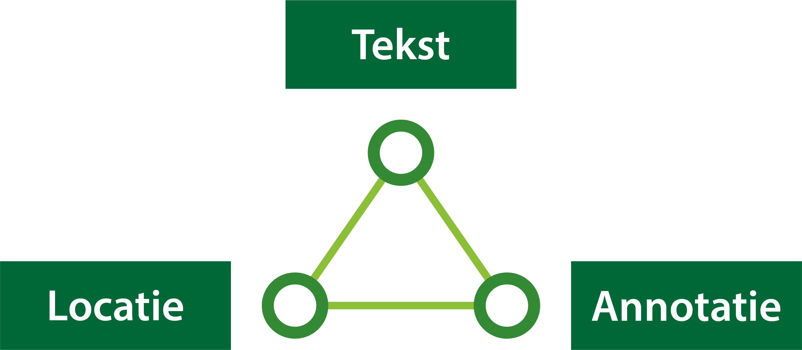

#### Opbouw van de beleidstekst

Het bevoegd gezag heeft de mogelijkheid om in de Omgevingsvisie beleidstekst op te stellen die iets zegt over 
het beleid met betrekking tot de fysieke leefomgeving. Om de beleidstekst in het Digitale Stelsel Omgevingswet 
te laten landen, is in de STOP/TPOD uitgewerkt hoe deze zowel mens- als machineleesbaar kan worden gemaakt.

Zoals in 2. Besluitonderdelen en tekstmodel omgevingsvisie is uitgewerkt, bestaat een omgevingsdocument uit
structuurelementen (STOP) en IMOW-objecten (TPOD). Binnen de structuurelementen zijn informatiekundige elementen
aangewezen waaraan informatie of een IMOW-object gekoppeld kan worden, ook wel een annotatie genoemd. 
In de Omgevingsvisie kan informatie gekoppeld worden aan de divisie, ofwel de kop. Dit geldt alleen binnen het 
inhoudelijke deel van de omgevingsvisie. De bijlagen kennen een bijna gelijke structuur, maar gaan niet over de 
juridische inhoud. Om deze reden kun je deze bestanden ook niet annoteren.

De inhoud hangt altijd onder een divisie. De inhoud is het structuurelement in het lichaam van de regeling dat de 
juridisch authentieke inhoud bevat. In de omgevingsvisie is de beleidstekst de juridische inhoud die in de inhoud 
staat. De inhoud kan alleen voorkomen binnen een divisie.

Om de beleidstekst in het Digitale Stelsel Omgevingswet te laten landen bestaat deze uit verschillende onderdelen:

*Onderdelen van beleidstekst*

De divisie is het structuurelement waarbinnen de informatie voorkomt over **wat** er geldt. De divisie is gekoppeld aan een locatie die
aangeeft **waar** de beleidstekst geldt. Tot slot kan de divisie nog voorzien worden van extra informatie die aangeeft **waarover** 
de beleidstekst gaat, door middel van annotaties.

In dit deel van de wegwijzer lees je meer over deze onderdelen van de beleidstekst.
