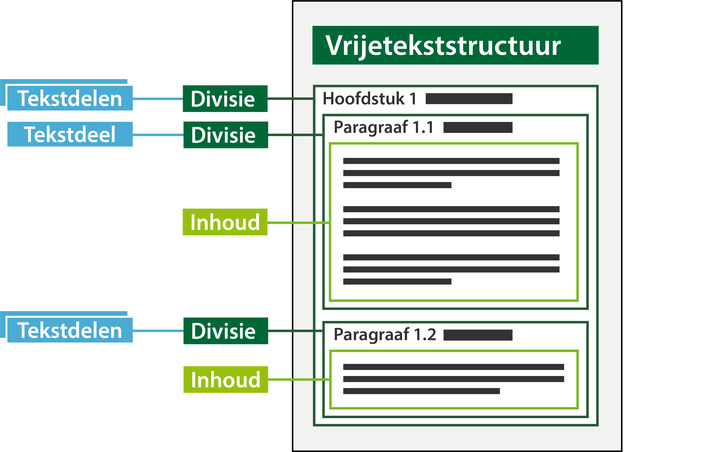

#### Divisie en tekstdeel

Voor het onderdeel van omgevingsdocumenten met een Vrijetekststructuur dat de daadwerkelijke inhoud van het omgevingsdocument 
bevat, onderscheidt het IMOW de objecttypen Divisie en Tekstdeel. Divisie is de kleinste zelfstandige eenheid van tekst.
Tekstdeel is een abstract concept waarmee een deel van een tekst wordt beschreven. Het tekstdeel wordt gebruikt om aan verschillende 
onderdelen van een divisie locaties en annotaties met de inhoudelijke IMOW-objecten te kunnen koppelen. Een divisie bevat altijd 
ten minste één tekstdeel, maar wanneer dat gewenst is, kan een divisie meerdere tekstdelen bevatten.

De annotaties kunnen een locatie, gebiedsaanwijzing, thema of hoofdlijn zijn. In het kader van beheren en muteren moet iedere
annotatie via een separaat Tekstdeel gekoppeld worden. De reden hiervoor is dat bijv. thema of hoofdlijn geen eigen identificatie hebben.  
In het geval van bijvoorbeeld een thema kunnen meerdere thema’s naar hetzelfde tekstdeel verwijzen, maar bij een combinatie van bijvoorbeeld 
locatie en thema is het dan weer vereist om verschillende tekstdelen te gebruiken. Er kunnen ook meerdere tekstdelen naar een (of meerdere) 
divisie(s) verwijzen. Zie afbeelding hieronder.

*Conceptuele weergave van divisie en tekstdelen*

**Let op dat het STOP-tekstmodel het structuurelement Divisie kent en IMOW het objecttype Divisie. Ze zijn niet hetzelfde.**
Het STOP-structuurelement Divisie wordt gebruikt voor alle onderdelen van besluiten en regelingen die geen artikelen bevatten. 
Dat is ruimer dan het IMOW-object Divisie, dat alleen kan voorkomen in het inhoudelijke deel van een omgevingsdocument met 
een vrijetekststructuur.

Bij bevraging in bijvoorbeeld DSO-LV zal altijd de volledige inhoud onder de divisie als resultaat worden weergegeven en nooit het
individuele tekstdeel. Om de inhoud te kunnen bevragen op de kaart in DSO-LV moet er een locatie gekoppeld worden aan de divisie. 
Verderop in deze pagina vind je uitleg over locaties.

Verder is het mogelijk om de divisie te annoteren. Annoteren is noodzakelijk om het bevragen van de inhoud in DSO-LV mogelijk te maken.
Ook is het annoteren noodzakelijk om de inhoud op een betekenisvolle manier te verbeelden op de kaart in DSO-LV. Meer informatie over 
annoteren in relatie tot presenteren vind je in paragraaf 2.1 van het Presentatiemodel.

Meer informatie over de divisie en het tekstdeel vind je in paragraaf
6.2.1.2 van de TPOD.
