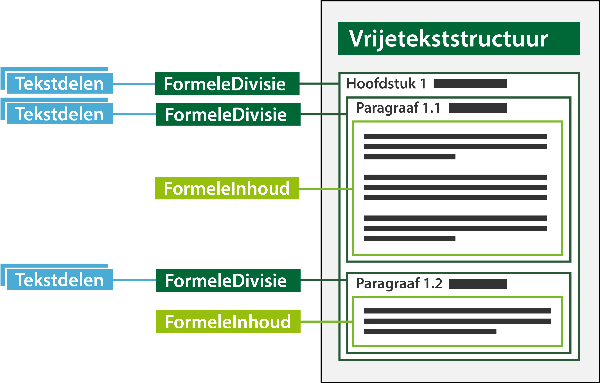

#### Formele divisie en tekstdeel

De formele divisie is een structuurobject waarin beleidsteksten in de vorm
van formele inhoud vastgelegd worden en komt van origine uit de officiële
overheidspublicaties (STOP). Het is daar in principe de kop boven de formele
inhoud. Kort gezegd is de formele divisie het object wat de koppeling vormt 
tussen objecten van de Omgevingswet (Toepassingsprofielen) en Officiële publicaties (STOP).

Het lijkt logisch om annotaties te verwijzen naar de formele inhoud, maar om
naar deze objecten te kunnen verwijzen vanuit de omgevingswet is een ander
type koppeling nodig om de annotatie te kunnen maken. Bovendien komt bij de bevraging 
de kop (bijvoorbeeld hoofdstuk) ook mee. Hiermee is de optimale koppeling gewaarborgd.

Tekstdeel is een conceptuele constructie waarmee een annotatie naar een Formele
Divisie kan verwijzen. Deze annotaties kunnen een locatie, gebiedsaanwijzing,
thema of hoofdlijn zijn. In het kader van beheren en muteren moet iedere
annotatie via een separaat Tekstdeel gekoppeld worden. De reden hiervoor is
dat bijv. thema of hoofdlijn geen eigen identificatie hebben.  In het geval van
bijvoorbeeld een thema kunnen meerdere thema’s naar hetzelfde tekstdeel
verwijzen, maar bij een combinatie van bijvoorbeeld locatie en thema is het dan
weer vereist om verschillende tekstdelen te gebruiken. Er kunnen ook meerdere
tekstdelen naar een (of meerdere) formele divisie(s) verwijzen. Zie afbeelding
hieronder.

*Conceptuele weergave van formele inhoud, formele divisie en tekstdelen*

Bij bevraging in bijvoorbeeld DSO-LV zal altijd de volledige formele inhoud
onder de formele divisie als resultaat worden weergegeven en nooit het
individuele tekstdeel.

Om de formele inhoud te kunnen bevragen op de kaart in DSO-LV moet er een
locatie gekoppeld worden aan de formele divisie. Verderop in deze pagina vind je
uitleg over locaties.

Verder is het mogelijk om de formele divisie te annoteren. Annoteren is
noodzakelijk om het bevragen van de formele inhoud in DSO-LV mogelijk te maken.
Ook is het annoteren noodzakelijk om de formele inhoud op een betekenisvolle
manier te verbeelden op de kaart in DSO-LV. Meer informatie over annoteren in
relatie tot presenteren vind je in paragraaf 2.1 van het Presentatiemodel.

Meer informatie over de formele divisie en het tekstdeel vind je in paragraaf
6.2.1 van de TPOD.
