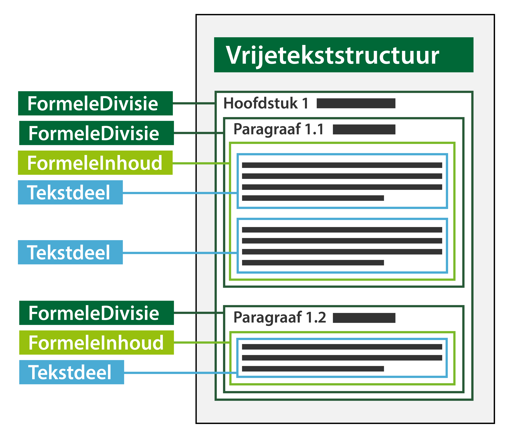

#### Formele inhoud en tekstdeel

Formele inhoud is de STOP/TPOD-term voor de kleinste zelfstandige eenheid van
(een of meer) bij elkaar horende tekstdelen in een tekst met vrijetekststructuur
die juridische inhoud bevat.

Formele inhoud bevat altijd ten minste één tekstdeel; wanneer dat gewenst is kan
formele inhoud meerdere tekstdelen bevatten. In de formele inhoud met meerdere
tekstdelen zijn de individuele tekstdelen minder makkelijk als zelfstandige
eenheden te identificeren.

Tekstdeel is een conceptuele constructie die noodzakelijk is om onderdelen van
een formele inhoud een eigen locatie te kunnen geven.

Meer informatie over de formele inhoud en het tekstdeel vind je in paragraaf
6.2.1 van de TPOD.

*Conceptuele weergave van formele inhoud en tekstdeel*

Bij bevraging in bijvoorbeeld DSO-LV zal altijd de volledige formele inhoud als
resultaat worden weergegeven en niet het individuele tekstdeel.

Om de formele inhoud te kunnen bevragen op de kaart in DSO-LV moet er een
locatie gekoppeld worden aan de formele inhoud. Verderop in deze pagina vind je
uitleg over locaties.

Verder is het mogelijk om de formele inhoud te annoteren. Annoteren is
noodzakelijk om het bevragen van de formele inhoud in DSO-LV mogelijk te maken.
Ook is het annoteren noodzakelijk om de formele inhoud op een betekenisvolle
manier te verbeelden op de kaart in DSO-LV. Meer informatie over annoteren in
relatie tot presenteren vind je in paragraaf 2.1 van het Presentatiemodel.
