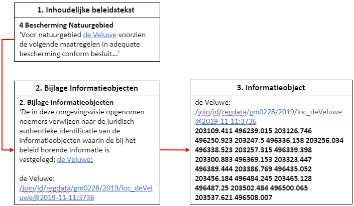

#### Geografisch informatieobject en noemer

De geometrische begrenzing van een werkingsgebied, en dus van de locatie(s), kan
niet in tekstuele vorm leesbaar weergegeven worden; het is een lijst van
coördinaten. De locaties, die opgeteld samen het werkingsgebied vormen, worden
daarom vastgelegd in een geografisch informatieobject (GIO). Een GIO is een
informatieobject met ten minste één geometrie.

Om vanuit de tekst van het omgevingsdocument op een juridisch juiste manier te
verwijzen naar het GIO, heeft deze een noemer en een identificatie. Een noemer
is een naam die in de tekst opgenomen wordt en waaruit de lezer kan begrijpen
waar het (geografisch) informatieobject betrekking op heeft. De noemer en
identificatie zijn verplichte onderdelen van de inhoud van het informatieobject.

Door de noemer van het geografisch informatieobject met de bijbehorende
identificatie ook in de bijlage van het besluit op te nemen, wordt het onderdeel
van het besluit en krijgt het juridische status.

Onderstaand figuur geeft een voorbeeld van hoe de noemer eruit ziet, beschouwd
vanuit de tekst, de bijlage en het informatieobject.

*Noemer in de tekst, de bijlage en het informatieobject*
