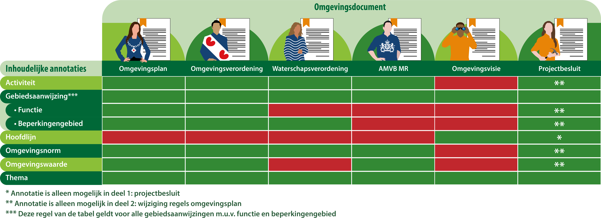

#### Toepassen van annoteren

In de TPOD is gespecificeerd van welke annotatie mogelijkheden er gebruik
gemaakt kan of moet worden volgens IMOW. In onderstaande tabel is voor de
inhoudelijke annotaties uitgewerkt welke van toepassing zijn in welke
omgevingsdocumenten. 
Toelichting op de kleurgebruik in de tabel:

Groen= Annotatie is van toepassing

Rood= Annotatie is niet van toepassing

*Annotatiemogelijkheden per omgevingsdocument*

In de TPOD Omgevingsvisie is in paragraaf 6.4 nader uitgewerkt wat deze
annotaties omvatten en welke typen en attributen ze hebben. Ook is in de TPOD
aangegeven welke regels er gelden voor het gebruik van de annotatie. Het is niet
de bedoeling om in deze praktijkrichtlijn volledig alle annotaties uit te
werken, maar om meer uitwerking te geven aan hoe die annotaties in de praktijk
gaan werken.

Een tekstdeel kun je annoteren met een (of meerdere) van bovenstaande
inhoudelijke annotaties. Een annotatie kan -in inhoudelijke zin- betrekking
hebben op een heel tekstdeel of, indien gewenst, op een onderdeel daarvan. In
technische zin zal een annotatie echter gekoppeld worden op het niveau van het
tekstdeel. Elke annotatie verwijst naar de identificatie van het tekstdeel.

In het DSO-LV zal bij bevraging het hele tekstdeel getoond worden en niet alleen
het stukje tekst waar de annotatie inhoudelijk betrekking op heeft. Op deze
manier wordt de volledige context getoond (zie p. 42 in de TPOD).

of

In het DSO-LV zal bij bevraging altijd de volledige formele divisie als resultaat
worden weergegeven en niet de individuele formele inhoud. Op deze manier wordt de
volledige context getoond inclusief alle koppen (zie p. 29 in de TPOD).

Zie onderstaande figuren voor een schematische weergave.

[invoegen afbeelding zodra deze klaar en gecontroleerd is]

*Annoteren tekstdeel*
