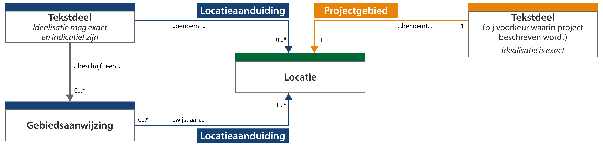

#### Locatie en projectgebied in context

Omdat het projectbesluit zelf (deel 1 van het projectbesluit) volgens de TPOD geen
werkingsgebied bevat en het ambtsgebied nagenoeg altijd groter is dan het gebied
waar het project uitgevoerd wordt, moet bij het projectbesluit altijd een
projectgebied bijgesloten worden. Dit wordt voorgeschreven in de vorm van een
locatie, bij voorkeur in het tekstdeel waarin het project beschreven wordt. Deze
locatie dient *exact* begrensd te worden. Paragraaf 6.2.4. van de TPOD geeft aan
wat precies tot het projectgebied gerekend moet worden.

Naast het projectgebied zelf kunnen in de verschillende tekstdelen aanvullende
locaties opgenomen worden om bepaalde specifieke gebieden aan te duiden.

Om de termen locatie en projectgebied en hun onderlinge relatie goed te kunnen
duiden, is een toelichting nodig op begrippen die met deze twee termen van doen
hebben. In onderstaand figuur zijn deze begrippen in vereenvoudigde weergave met
elkaar in verband gebracht.

*Conceptuele weergave van locatie en projectgebied en de relatie met andere
relevante begrippen*

In de gepresenteerde samenhang van de begrippen wordt duidelijk dat een locatie
op twee manieren kan worden ‘aangeroepen’:

-   als locatieaanduiding van een tekstdeel of gebiedsaanwijzing (blauw);

-   als projectgebied van een tekstdeel (oranje).

Één locatieaanduiding vanuit een tekstdeel zoals in het blauw hierboven,
verwijst altijd naar een locatie die zich binnen het projectgebied bevindt of
deels dezelfde afbakening heeft. Er kan geen locatie zijn die zich (deels)
buiten het projectgebied bevindt.

Het figuur laat ook zien dat zowel gebiedsaanwijzing als tekstdeel een relatie
hebben met de locatie. Hierbij is de relatie met locatie een locatieaanduiding.
Waar het tekstdeel de locatie *benoemt*, zal een locatieaanduiding vanuit de
gebiedsaanwijzing de annotatie met de locatie *aanwijzen*. De gebiedsaanwijzing
verwijst naar dezelfde locatie, als de locatie die door de relevante tekstdelen
gedefinieerd wordt.
