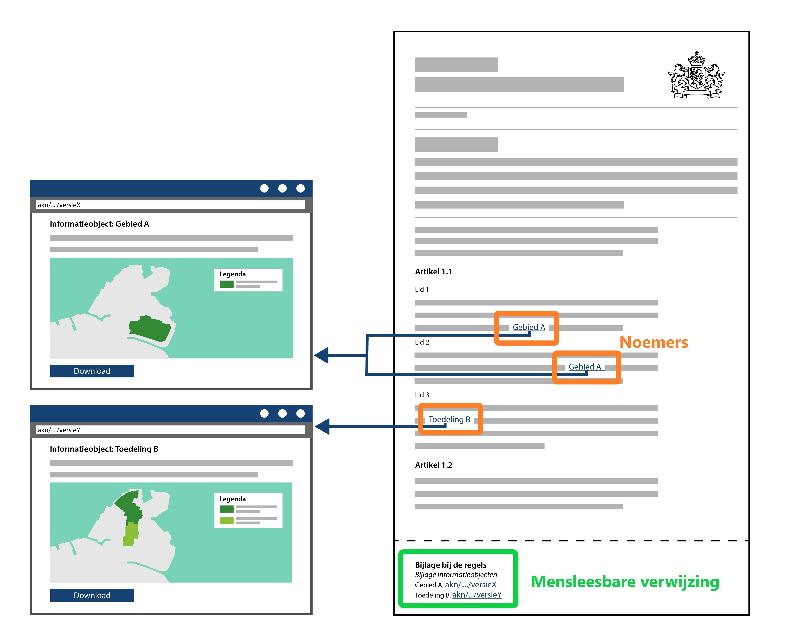

#### Presenteren van een besluit of regeling

Een besluit bestaat uit de verschillende besluitonderdelen (regelteksten of
teksten met een vrijetekststructuur), inclusief de verwijzing naar
(geografische) informatieobjecten. Een besluit kan de vaststelling van een
initieel besluit (een eerste versie) betreffen of een wijziging van een eerder
genomen besluit.

De verwijzing naar een informatieobject dient in de mensleesbare weergave van
het besluit opgenomen te worden middels een mensleesbare betekenisvolle noemer
zodat duidelijk is welke informatie als onderdeel van het besluit is
vastgesteld. Het presentatiemodel legt de verbinding tussen het informatieobject
en het besluit door de noemer van het informatieobject in de tekst op te nemen.
Op deze wijze wordt het informatieobject onderdeel van het besluit en krijgt het
juridische status.

*Mensleesbare noemers en verwijzingen naar geografische informatieobjecten in de
tekst van het besluit*

De geconsolideerde versie van een omgevingsdocument wordt afgeleid uit het
initiële besluit waarin steeds de (in werking getreden) wijzigingen uit de
wijzigingsbesluiten zijn verwerkt tot een doorlopende versie van het
omgevingsdocument. Dit wordt de geconsolideerde versie van het omgevingsdocument
genoemd. De geconsolideerde versie vormt de basis voor de weergave van de
regeling op overheid.nl en van het omgevingsdocument dat in het DSO-LV te
raadplegen is.

Het verschil tussen de LVBB en het DSO-LV is dat de LVBB document georiënteerd
is, terwijl het DSO-LV geconsolideerde informatie laat zien over de
interbestuurlijke documenten heen en in combinatie met de ruimtelijke plannen.

De verschijningsvormen van besluiten en regelingen kunnen van elkaar verschillen
afhankelijk van het medium waarin ze geraadpleegd worden. Voor de presentatie
maken ze echter gebruik van dezelfde principes. Deze principes worden in de
volgende paragrafen beschreven voor de presentatie van tekst en voor de
presentatie in kaartbeeld
