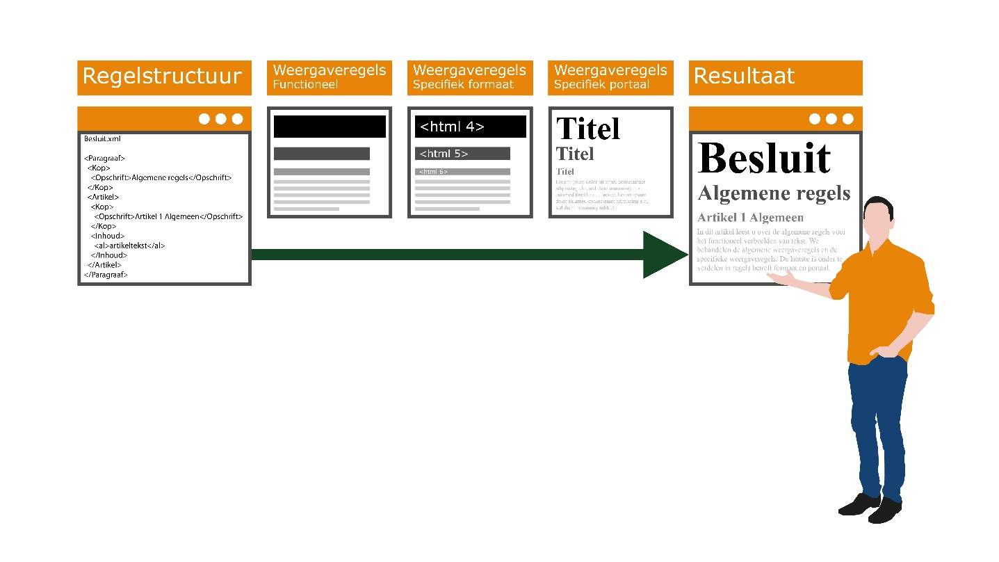

#### Presenteren van tekst

Voor het presenteren van tekst gaat het presentatiemodel uit van het principe
van functioneel presenteren. Dit houdt in dat het presentatiemodel functionele
eisen stelt aan wát er weergegeven moet worden, maar niet voorschrijft welke
exacte opmaakstijl moet worden gebruikt. De stijl van presenteren staat los van
het besluit. Dat maakt het flexibel. Dezelfde informatie kan in verschillende
media in een andere kleur of font weergegeven worden.

De functionele weergaveregels gaan uit van een bepaalde hiërarchische structuur
in een tekst. Deze hiërarchische structuur is bepalend voor hoe de tekst
gepresenteerd kan worden. De koppen en teksten moeten een relatieve grootte
hebben die past bij de hiërarchische structuur van de tekst.

Zie onderstaande figuur voor een conceptuele weergave van het principe van
functioneel presenteren van tekst.

*Principe van functioneel presenteren van tekst*

Voor meer informatie over functioneel presenteren van tekst verwijzen we je naar paragraaf 5.1.1 van het presentatiemodel.