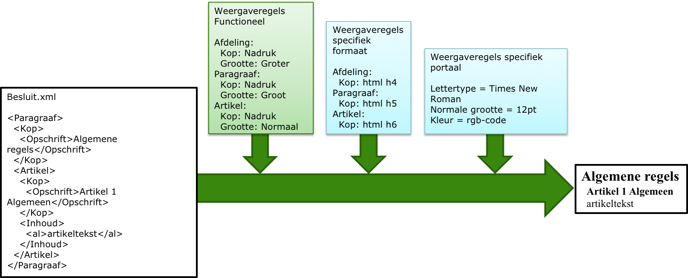

#### Tekstpresentatie van teksten met een artikelstructuur

Bij teksten met regels is de artikelsgewijze opbouw kenmerkend. De artikelstructuur bestaat uit 
tekstelementen.Deze tekstelementen kunnen worden gebruikt voor de structurering van het lichaam 
van de tekst. Voorbeelden zijn hoofdstuk, titel, afdeling, paragraaf, subparagraaf, subsubparagraaf, 
artikel en lid. Voor de presentatie van OW-besluiten met een artikelstructuur is de tekststructuur 
van de tekstelementen van belang.  

De TPOD van het omgevingsdocument beschrijft in paragraaf 5.2 de specificatie van de
artikelstructuur. In deze specificatie is beschreven welke tekstelementen zijn
toegestaan in het omgevingsdocument en in welke hiërarchische volgorde deze dienen te
staan.

De verschillende tekstelementen moeten worden voorzien van een kop. Een kop
bevat de volgende kopelementen:

-   Label: de tekstuele aanduiding van het type van het tekstelement

-   Nummer: de unieke, numerieke aanduiding van het tekstelement

-   Opschrift: de tekstuele aanduiding van het tekstelement, waarmee de inhoud
    van het onderdeel beknopt wordt aangeduid.

In paragraaf 5.2 van de TPOD is gespecificeerd welke regels er gelden voor de in
dit omgevingsdocument voorkomende koppen.

In welke font en korpsgrootte de kop opgemaakt wordt, mag zelf bepaald worden,
zolang het principe van functionele tekstpresentatie wordt toegepast. De TPOD
van het omgevingsdocument legt de hiërarchische volgorde van de tekstelementen vast.
Deze volgorde wordt uitgedrukt in relatieve groottes ten opzichte van het
kleinste element en dient ook gehanteerd te worden bij de opmaak van tekst
(corpsgrootte van het lettertype) die aan een raadpleger wordt getoond. De kop
moet dus een relatieve grootte hebben die past bij de hiërarchische opbouw van
de tekst.

*Principe van functionele tekstpresentatie van tekst met een artikelstructuur*
