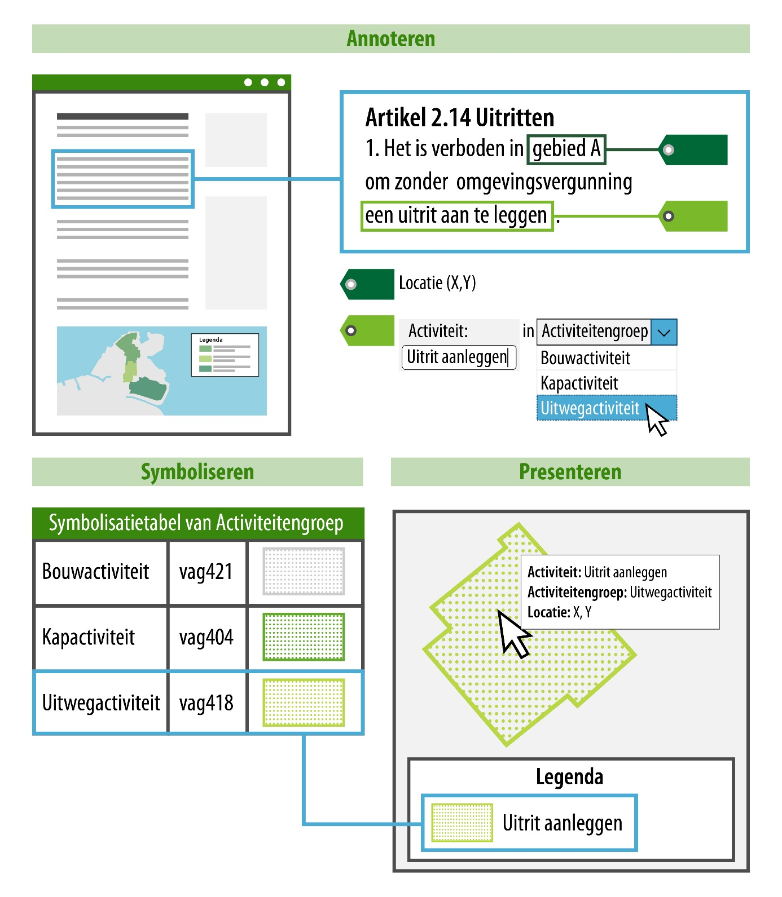

#### Presentatie in kaartbeeld: annoteren – symboliseren – presenteren

Voor de functionele presentatie in kaartbeeld is annoteren 
belangrijk. De volgende inhoudelijke annotaties zijn gekoppeld aan een locatie
en kunnen daarom gebruikt worden om een geometrie te verbeelden:

-   Activiteit;

-   Gebiedsaanwijzing;

-   Omgevingswaarde;

-   Omgevingsnorm.

In een omgevingsvisie kan alleen geannoteerd worden met de gebiedsaanwijzing.

In het presentatiemodel worden deze inhoudelijke annotaties en hun attribuut
*groep* gebruikt om te bepalen met welke symboliek (kleur/arcering) een locatie
in een kaartbeeld wordt weergegeven. Het principe hiervoor is generiek en kan
toegepast worden op alle bovenstaande annotaties.

Dit principe kan het best toegelicht worden aan de hand van het voorbeeld in
onderstaande afbeelding.

*Conceptuele verbeelding van het principe annoteren - symboliseren -
presenteren*

Bovenstaand voorbeeld laat zien hoe dit principe werkt bij het annoteren van een juridische regel. 
Het principe is echter generiek en kan daarom ook toegepast worden op de tekstdelen in de inhoud 
van de omgevingsvisie.

In het voorbeeld zie je een juridische regel waaraan een locatie is gekoppeld:
gebied A. Ook is in de juridische regel de activiteit geannoteerd: een uitrit
aanleggen. Bij het annoteren van de activiteit kan ook een activiteitengroep
gekozen worden, in dit geval: uitwegactiviteit. De activiteitengroep staat in de
symbolisatietabel waaraan een symbolisatie is gekoppeld, deze symbolisatie wordt
op de kaart als verbeelding van de activiteit getoond.

De waarde van het attribuut groep van de annotatie bepaalt dus de symbolisatie
waarmee de locatie wordt verbeeld op de kaart.

Ditzelfde principe kan ook toegepast worden op bijvoorbeeld de annotatie gebiedsaanwijzing. 
Het attribuut *groep* is bepalend voor de symbolisatie waarmee een locatie wordt verbeeld op de kaart.

**Symbolisatiemethoden**

Met welke exacte symboliek een locatie in een kaartbeeld wordt getoond, is
afhankelijk van de symbolisatiemethode die wordt toegepast.

Het presentatiemodel biedt vier verschillende mogelijkheden om een locatie op
een kaartbeeld in een viewer weer te geven:

1.  Symbolisatie op basis van een afgesproken standaard symbolisatie.

2.  Een eigen symbolisatie die afwijkt van de standaard symbolisatie.

3.  Een symbolisatie specifiek bedoeld voor een kaartviewer, afwijkend van
    bovenstaande symbolisatie.

4.  Werkingsgebieden.

Een uitleg over de vier symbolisatiemethoden met voorbeelden vind je in
hoofdstuk 3 van het presentatiemodel.
