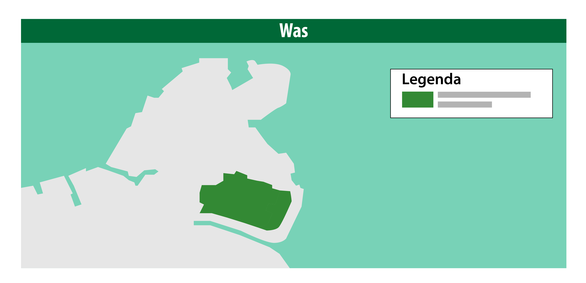
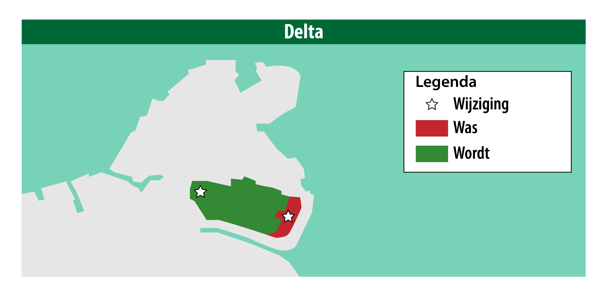
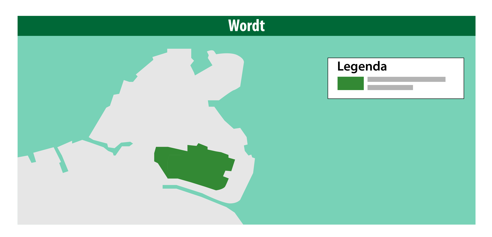

#### De stappen voor het wijzigen van een werkingsgebied van een besluit

In de afbeelding hieronder staat een vorige versie van een omgevingsdocument in
de software: Was. De volgende stap is om een gewijzigde versie van het besluit
te maken. Hier worden in de software wijzigingen aangebracht. Dit kan een
wijziging zijn aan de gehele regeling of slechts een annotatie die men als extra
service voor de vindbaarheid of het opvragen van toepasbare regels toevoegt.
Muteren betekent kort gezegd toevoegen, verwijderen of wijzigen van het besluit.
In het vorige besluit hierboven wordt een kopie gemaakt met een nieuwe versie.

*Oude/vorige versie van een omgevingsdocument*

Er wordt een deel van het gebied verwijderd in de afbeelding hieronder in het
gebied. Dat betekent dat ook het werkingsgebied van deze activiteiten gewijzigd
moet worden.

De software bepaalt het verschil tussen het oude en het nieuwe (gewijzigde)
besluit. Het verschil gaat als bericht naar de LVBB voor bekendmaking waar de
wijzigingen vervolgens ook opgenomen worden.

De LVBB verwerkt het verschil tussen de twee besluiten en maakt een nieuwe
geconsolideerde versie van het omgevingsdocument. Het verschil heet ook wel de
delta.

*Wijziging van een omgevingsdocument*

In de afbeelding hieronder zijn de locaties die niet meer van toepassing zijn,
geschrapt. De geometrie is aan de rechterkant in zijn geheel verwijderd, omdat
er geen werkingsgebied meer van toepassing is op deze set aan besluiten.

*Het nieuwe (gewijzigde) omgevingsdocument*

Als onderdeel van de validatie van een besluit zal de LVBB de geconsolideerde
regeling samenstellen. De LVBB voert geen consolidatie uit maar gebruikt de
informatie uit de mutatie om de versie van de regeling samen te stellen.

Als dit niet mogelijk is, of als de geconsolideerde regeling niet aan de
gestelde eisen voldoet (zoals vermeld in de STOP standaard en in het
toepassingsprofiel voor de regeling), dan wordt het besluit als niet valide
beschouwd en kan het niet bekendgemaakt worden.

De LVBB zorgt ervoor dat het besluit bekendgemaakt wordt. Pas na bekendmaking
van het besluit kan de inhoud ervan (en de nieuwe toestand van de
geconsolideerde regeling) in werking treden. De LVBB zorgt er ook voor dat zowel
het besluit als de regeling verder verspreid worden. Zo zijn de
omgevingsdocumenten na de bekendmaking beschikbaar voor het DSO.

Deze wijziging wordt ook verspreid richting het digitaal stelsel Omgevingswet,
bijvoorbeeld naar alle wettenbanken, het Omgevingsloket en DSO-LV. Zij halen
hier informatie op.

Na validatie en registratie van het besluit, dus nog **vóór de bekendmaking,**
zal via het aanleverkoppelvlak een notificatie verstuurd worden aan bevoegd
gezagen die (mede)bronhouder zijn van het besluit en/of de resulterende
regelingen dat nieuwe versies beschikbaar zijn. Ze krijgen een terugkoppeling en
validatie terug richting de eigen software.

De besluiten en regelingen zijn ook op te halen. In principe worden er afspraken
gemaakt, waarin staat wie er naast de bronhouder nog mag muteren.
