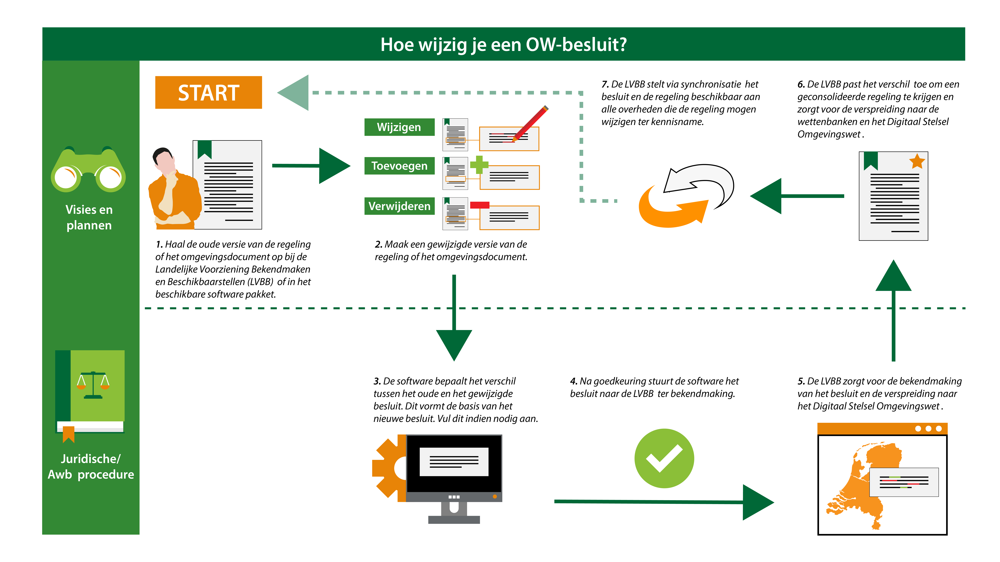

#### De stappen voor het wijzigen van een besluit

Het wijzigen van een Omgevingsdocument start bij het vinden van het geldende besluit. 
Dit besluit wordt in ieder geval op de LVBB gepubliceerd en opgeslagen als juridische 
waarheid, maar kan ook in de software worden opgeslagen. Het is mogelijk om van dit 
besluit een nieuwe versie aan te maken en deze te bewerken. Daarnaast is het ook mogelijk
om zonder besluit een mutatie van OW-informatie te doen.

*Weergave hoe een Omgevingsdocument gewijzigd wordt binnen de Omgevingswet*

Het bevoegd gezag maakt op basis van een eerder bekend gemaakte versie een
wijzigingsbesluit waarin de beoogde wijzigingen zijn aangebracht. Betreft het
een nieuwe regeling, dan maken medewerkers de initiële versie. Dit is het
startpunt in de afbeelding hierboven.

Een nieuwe versie van het besluit is nodig om later te kunnen tijdreizen en aan
te wijzen welke besluiten zijn genomen in een bepaalde versie. De laatste
wijzigingen in een versie worden in de eerste instantie bewerkt tot een nieuwe
geconsolideerde versie.

Het bevoegd gezag moet een formeel besluit nemen over de wijziging. De
beschrijving van de wijzigingen wordt door software bepaald; de medewerkers
vullen dat aan met bijvoorbeeld een motivatie voor het wijzigen van de regeling.

Na goedkeuring zal het besluit ter bekendmaking aan de LVBB worden verstuurd.
Onderdeel van het bericht is de mutatie zoals door het IMOP wordt beschreven.

Hoe wijzigingsbesluiten er voor de bekendmaking en consolidatie uit moeten zien 
en hoe ze moeten worden aangeleverd, is beschreven in de STOP-documentatie. 
