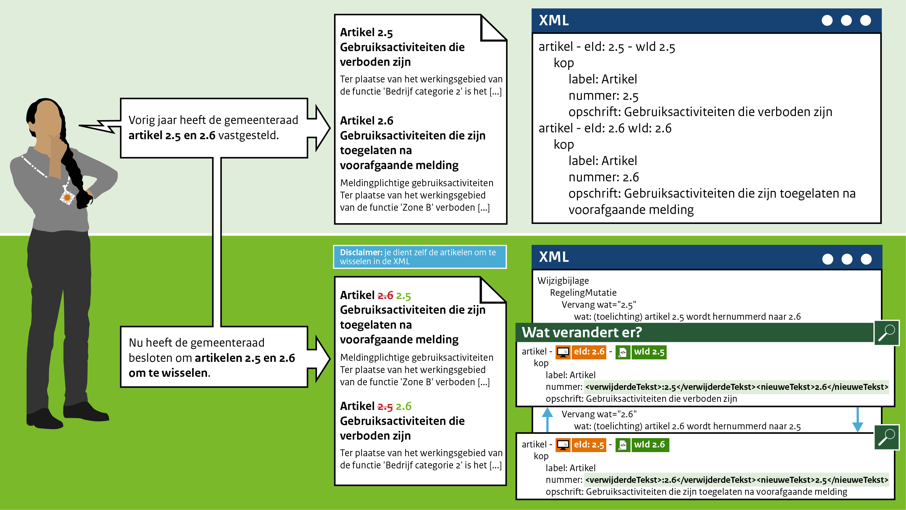

####Omwisselen van artikelen

Het mutatiescenario in het leven geroepen om artikelen om te kunnen wisselen als bijvoorbeeld
een artikelvolgorde is vastgesteld, maar men het duidelijker vindt om de volgorde te wijzigen.

Bijvoorbeeld: De gemeenteraad van Gemeentestad heeft vorig jaar de artikelen 2.5 en 2.6
vastgesteld. Dit jaar hebben ze deze volgorde nog eens goed bekeken en zijn tot de conclusie
gekomen dat het logischer is om artikel 2.6 voor 2.5 te plaatsen. De gemeenteraad stelt dit jaar
vast dat de artikelen moeten worden omgewisseld. Uiteraard moeten deze ook hernummerd worden. 
Artikel 2.6 wordt artikel 2.5 qua nummering. 

 
