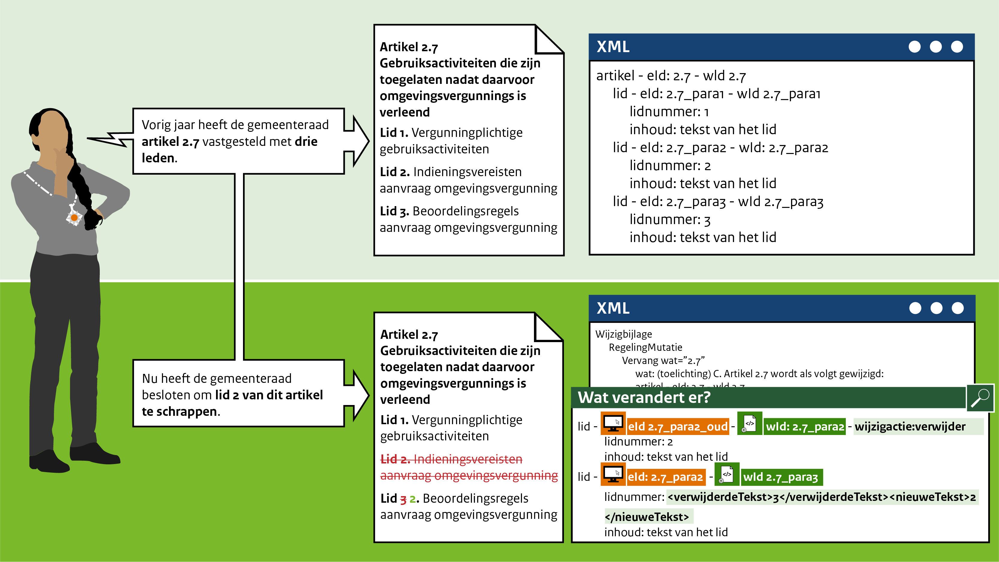

####Verwijderen van een lid

Het mutatiescenario in het leven geroepen om leden te kunnen verwijderen als deze niet meer van toepassing zijn.

Bijvoorbeeld: De gemeenteraad van Gemeentestad heeft vorig jaar **artikel 2.7 Gebruikersactiviteiten die zijn toegelaten
nadat daarvoor een omgevingsvergunning is verleend** met drie leden vastgesteld. Dit jaar heeft de gemeenteraad besloten 
om lid 2 betreffende de indieningsvereisten te schappen. Lid 3 wordt na hernummering lid 2. 

 
