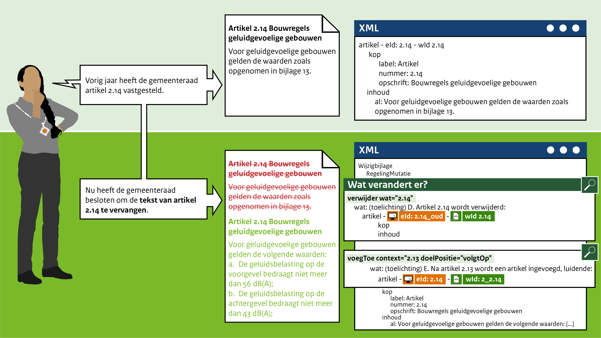

####Vervangen van een artikel

Het mutatiescenario in het leven geroepen om artikelen te kunnen vervangen als deze bijvoorbeeld
de inhoud van het artikel gewijzigd is, maar wel dezelfde nummering houdt. Het artikel wordt
in zijn geheel vervangen.

Bijvoorbeeld: De gemeenteraad van Gemeentestad heeft vorig jaar artikel 2.14 Bouwregels geluidgevoelige gebouwen
vastgesteld. Dit jaar heeft de gemeenteraad besloten om de verwijzing naar een bijlage 13 met geluidsregels te schappen 
en deze meteen voor de duidelijkheid in het artikel te verwerken.

 
