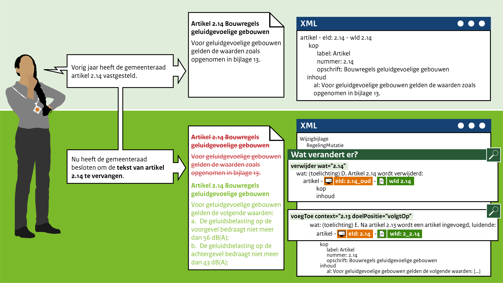

####Vervangen van een artikel

Dit mutatiescenario in het leven geroepen om artikelen te kunnen vervangen,bijvoorbeeld als de inhoud 
van het artikel gewijzigd is, maar het artikel wel dezelfde nummering houdt. Het artikel wordt in zijn
geheel vervangen.

Bijvoorbeeld: De gemeenteraad van Gemeentestad heeft vorig jaar artikel 2.14 Bouwregels geluidgevoelige gebouwen
vastgesteld. Dit jaar heeft de gemeenteraad besloten om de verwijzing naar een bijlage 13 met geluidsregels te schappen 
en deze in het artikel te verwerken.

Technisch gezien wordt bij het verwijderen van het artikel direct verwezen naar het wId dat geschrapt wordt (2.14).
Hierna kan er voor gekozen worden om het functionele ID aan te passen (2.14_oud). De toevoeging van het nieuwe artikel (2.14) 
betekent dat er een nieuw wId gebruikt wordt (2_2.14).

 
