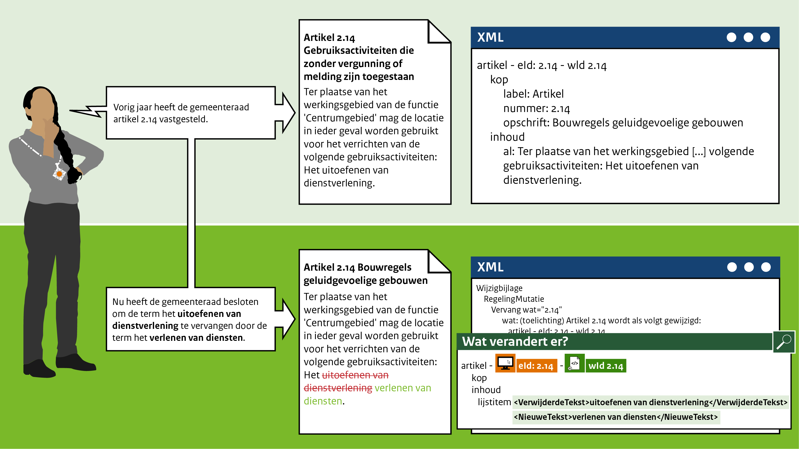

####Vervangen inhoud van een artikel

Het mutatiescenario in het leven geroepen om de inhoud van artikelen te kunnen wijzigen als deze bijvoorbeeld
een term bevat die gewijzigd dient te worden. Alleen dit deel uit het artikel wordt vervangen voor andere tekst.

Bijvoorbeeld: De gemeenteraad van Gemeentestad heeft vorig jaar artikel 2.14 Bouwregels geluidgevoelige gebouwen
vastgesteld. Dit jaar heeft de gemeenteraad besloten om de tekst **uitoefenen van dienstverlening** te wijzigen in
**verlenen van diensten**. Deze tekst wordt vervangen, zoals te zien is in bovenstaande afbeelding.

 
