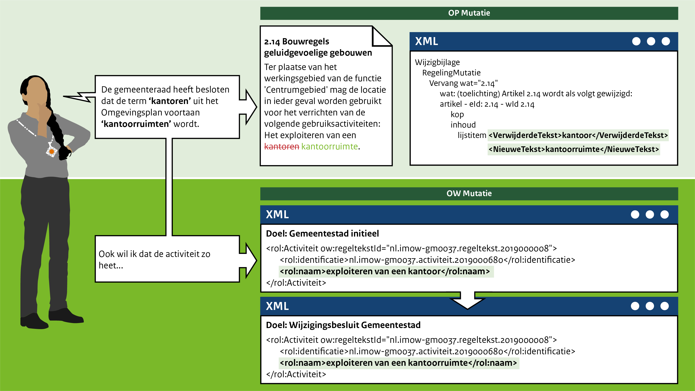

####Term in een artikel wijzigen

Het mutatiescenario is in het leven geroepen om een term in een of meerdereartikelen te kunnen wijzigen 
als deze bijvoorbeeld niet meer voldoet. Alleen de term uit het artikel wordt vervangen voor een andere term.

Bijvoorbeeld: De gemeenteraad van Gemeentestad heeft vorig jaar artikel 2.14 Bouwregels geluidgevoelige gebouwen
vastgesteld. Dit jaar heeft de gemeenteraad besloten om de term **kantoren** te wijzigen in
**kantoorruimten**. Verder wil de gemeenteraad dat ook de activiteit **exploiteren van een kantoor** ook 
**exploiteren van een kantoorruimte** gaat heten. Deze term wordt vervangen, zoals te zien is in bovenstaande afbeelding. 

 
