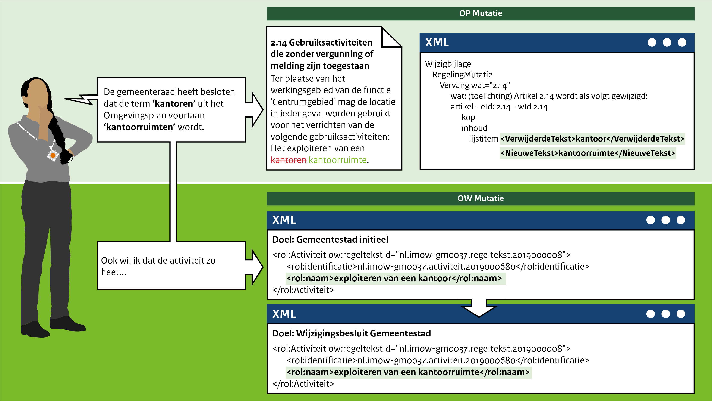

####Term in een artikel wijzigen

Het mutatiescenario is in het leven geroepen om te tonen hoe het eruitziet als er een annotatie 
(OW) wordt gewijzigd. Het wijzigen van een bepaalde term kan ertoe leiden dat niet alleen een wijziging 
in de tekst, maar ook in de annotaties wenselijk is. 

Bijvoorbeeld: De gemeenteraad van Gemeentestad heeft vorig jaar *artikel 2.14 Bouwregels geluidgevoelige
gebouwen* vastgesteld. Dit jaar heeft de gemeenteraad besloten om de term **kantoren** te wijzigen in
**kantoorruimten**. Verder wil de gemeenteraad dat ook de activiteit **exploiteren van een kantoor** ook 
**exploiteren van een kantoorruimte** gaat heten. Dit zorgt ervoor dat bij de ‘regels op de kaart’ in het DSO-LV 
de activiteit onder de nieuwe term terug te vinden is. 

 
