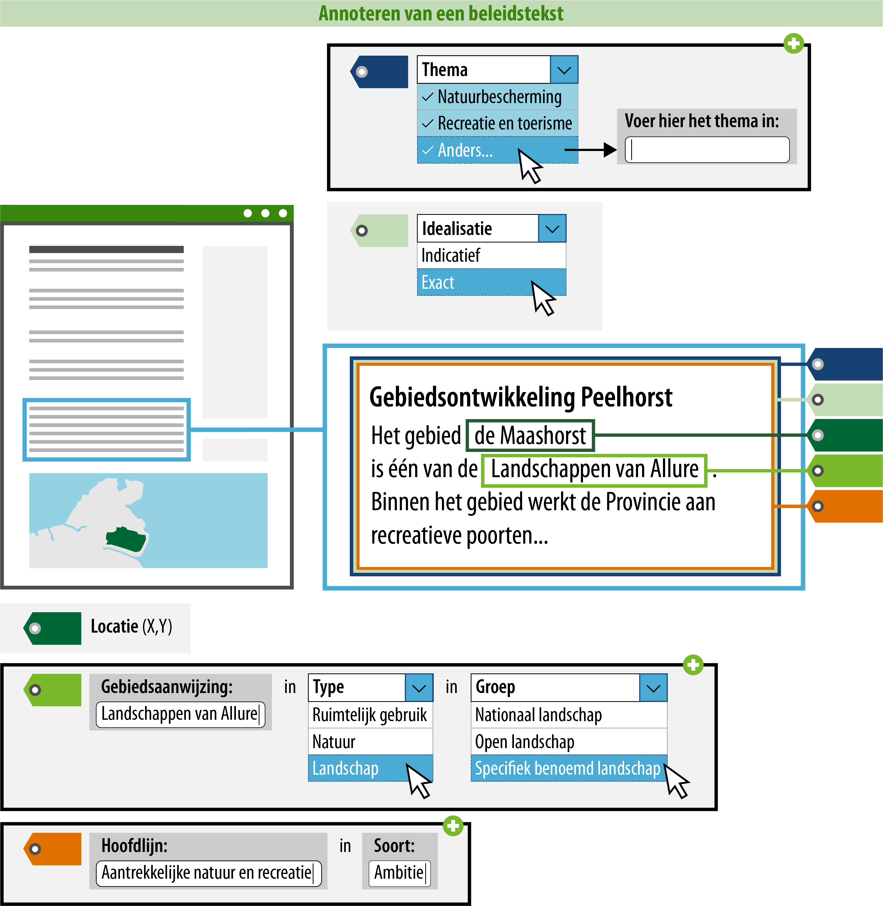

#### Wat kun je nog meer doen om de beleidsregel goed vindbaar en zichtbaar te maken?

Je kunt ervoor zorgen dat een raadpleger over meer informatie beschikt tijdens
het oriënteren middels tekst op de kaart. Door de gebiedsaanwijzing te
annoteren, kan deze gepresenteerd worden op de kaart en is het mogelijk om te
zoeken en te filteren op trefwoorden of categorieën.  
In onderstaand voorbeeld is uitgewerkt welke informatie hiervoor geannoteerd
**moet** worden.

*Conceptuele weergave van een geannoteerde beleidstekst*

>   **3. Naam: geef de gebiedsaanwijzing een naam.**  
>   Dit is de naam van de gebiedsaanwijzing waar de regel over gaat. Je
>   bent vrij in de keuze van de naam van de gebiedsaanwijzing. De naam van de gebiedsaanwijzing kan
>   letterlijk in de regel terug te vinden zijn (expliciet), maar het is ook mogelijk
>   de de gebiedsaanwijzing impliciet wordt gedefinieerd in de tekst van de regel. De naam moet 
>   uniek zijn binnen het plan, echter het kan wel voorkomen dat het dezelfde naam is als een gebiedsaanwijzing van een ander bevoegd gezag. De naam van 
>   de gebiedsaanwijzing mag dezelfde zijn als de naam van de genoemde gebiedsaanwijzingengroep.

>   De naam van de gebiedsaanwijzing die wordt geannoteerd, zal in het DSO ook de naam zijn waarop
>   gezocht en gefilterd kan worden. Hier moet bij de naamgeving rekening mee gehouden worden.
>   Daarom wordt geadviseerd om een logische en eenduidige naam te annoteren.

>   In bovenstaand voorbeeld heet de gebiedsaanwijzing 'Landschappen van allure'. 
>   Deze gebiedsaanwijzing valt onder het type 'Landschap'. De betekenis volgens de waardelijst:
>   Gebied dat is aangewezen door regels of beleid, gericht op de bescherming en de ontwikkeling 
>   van het landschap vanuit ander perspectief dan natuur en erfgoed. Met dit type kun je hier filteren
>   op landschap.

>   **4. gebiedsaanwijzinggroep: geef aan in welke gebiedsaanwijzinggroep deze
>   valt.**  
>   Hier geef je aan in welke gebiedsaanwijzinggroep de gebiedsaanwijzing valt. De
>   gebiedsaanwijzinggroep kies je uit een gesloten waardelijst. Dit betekent dat
>   er een vastgestelde lijst is van gebiedsaanwijzinggroepen die je kunt kiezen.
>   De mogelijke gebiedsaanwijzinggroepen vind je in de
>   [stelselcatalogus](https://stelselcatalogus.omgevingswet.overheid.nl/waardelijstenpagina).

>   In bovenstaand voorbeeld is gekozen voor gebiedsaanwijzinggroep 'Specifiek benoemd landschap'.
>   Dit attribuut zorgt voor de weergave van de symbolisatie van de gebiedsaanwijzing Landschap 
>   op de kaart in de software en later het DSO-LV. 

>   De lijst van mogelijke gebiedsaanwijzinggroepen zal uiteindelijk geïntergreerd
>   zijn in de plansoftware.

>   Voor de presentatie in een kaartbeeld is de gebiedsaanwijzinggroep bepalend.
>   Het attribuut groep bepaalt namelijk met welke symboliek (kleur/arcering) de
>   locatie waar de formele divisie over een gebiedsaanwijzing geldig is, in een kaartbeeld 
>   wordt weergegeven. De gebiedsaanwijzinggroep staat in de symbolisatietabel waaraan
>   een symbolisatie is gekoppeld, deze symbolisatie wordt op de kaart als
>   verbeelding van de gebiedsaanwijzing getoond. 

>   Het is mogelijk om de standaard presentatie toe te laten passen, maar je
>   kunt ook kiezen voor een afwijkende presentatie. Meer informatie over de
>   presentatie in kaartbeeld vind je op de pagina [Presenteren](/presenteren)
>   in deze wegwijzer. Indien je wil afwijken van de symbolisatie
>   van de gebiedsaanwijzinggroep, is het ook mogelijk om te verbeelden op de 
>   naam van de gebiedsaanwijzing. De standaard verbeelding van de gebiedsaanwijzingengroep 
>   wordt dan niet getoond in de publicatieportalen. In de DSO viewer krijgt 
>   de raadpleger de keuze een regelingspecifieke verbeelding te zien in plaats 
>   van de standaard verbeelding.

>   Wanneer een gebiedsaanwijzing in meerdere groepen past, is het aan het bevoegd gezag 
>   om te kiezen voor de gebiedsaanwijzinggroep waarop gefilterd kan worden en waarop (bij 
>   standaard verbeelding) verbeeld wordt. Zoals hiervoor aangegeven kan er 
>   alsnog van de verbeelding afgeweken worden.

