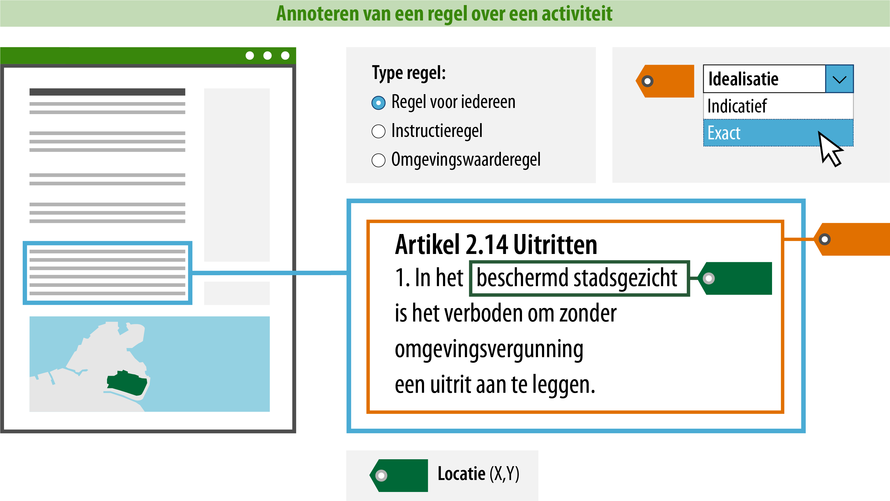

#### Wat moet jij doen?

Een groot deel van de nodige acties wordt door de software geautomatiseerd. Zo
zorgt de software voor de juiste koppeling tussen de IMOW-objecten, dat tekst en
kaart verbonden zijn en dat jij je bezig kunt houden met de inhoud. Dat laatste
is namelijk niet iets wat de software voor je kan doen. Als opsteller van het
omgevingsdocument moet je dus aan de slag met:

-   Het opstellen en annoteren van tekst (wat regel ik?);

-   Het koppelen van locaties aan de tekst (waar?).

Voor het annoteren van de tekst is hierna uitgelegd welke gegevens jij moet of
kunt toevoegen. Een deel van de gegevens zit in waardelijsten. De waardelijsten
zijn raadpleegbaar via de [stelselcatalogus
Omgevingswet](https://stelselcatalogus.omgevingswet.overheid.nl/waardelijstenpagina). 
De lijst van mogelijke waarden zal uiteindelijk geïntegreerd zijn
in de planmaaksoftware.

Zie hieronder een voorbeeld van een regel over het 'aanleggen van een uitrit'
 en wat jij als opsteller moet aangeven:

>   **1. Type regel: om welk type regel gaat het en aan wie is het gericht?**  
>   Er zijn drie typen regels die je kunt kiezen. Een regel voor iedereen,
>   een instructieregel of een omgevingswaarderegel. Een instructieregel is
>   gericht aan een ander instrument of taakbevoegdheid en een omgevingswaarderegel
>   is zelfbindend voor het bestuursorgaan dat de omgevingswaarde vaststelt. Een regel
>   over een activiteit is daarom altijd een 'regel voor iedereen'. 
>   Alle regels binnen een artikel moeten van hetzelfde type zijn. 

>   **2. Locatie: op welke locatie is deze regel van toepassing?**  
>   Om de raadpleger via Omgevingsloket van de juiste informatie te voorzien, is het
>   noodzakelijk om aan te geven waar de regel over een activiteit van toepassing is. Geef
>   hiervoor aan op welke locatie de regel van toepassing is.

>   **3. Idealisatie: is de begrenzing van de locatie exact of indicatief bedoeld voor deze regel?**
>   Als je hebt aangegeven op welke locatie deze regel van toepassing is, kun je
>   vervolgens met de idealisatie aangeven of de begrenzing van de locatie voor déze
>   regel exact of indicatief geïnterpreteerd moet worden. Dit attribuut zegt dus
>   iets over de begrenzing van de locatie voor díe specifieke regel. De reden
>   hiervoor is dat de locatie op deze manier ook voor andere regels gebruikt kan
>   worden, zonder dat ze dezelfde idealisatie moeten hebben. Indicatief kan
>   bijvoorbeeld gebruikt worden wanneer de begrenzing van de locatie bepaald is op
>   basis van een berekening of wanneer een locatie bedoeld is als indicatie of
>   zoekzone voor de plek voor een toekomstige ontwikkeling: pas later wordt de
>   daadwerkelijke plek bepaald.

Dankzij het annoteren van de ‘idealisatie’ en het aangeven van de bijbehorende
‘locatie’ is precies duidelijk waar de regel van toepassing is en hoe de locatie 
geïnterpreteerd moet worden. De raadpleger kan nu in het Omgevingsloket op een plek 
in de kaart prikken en ziet dan dat artikel 2.14 *daar* van toepassing is en kan zien
dat de regel *voor iedereen* (en dus ook voor hem) van toepassing is. 

Hij moet echter nog steeds wel de tekst lezen en correct interpreteren om te weten om welke 
activiteit het gaat en of deze verboden, vergunningsplichtig et cetera is. Ook is deze 
methode niet voldoende om via de vergunningchecker te kunnen achterhalen of hij ergens 
een vergunning voor moet aanvragen. 