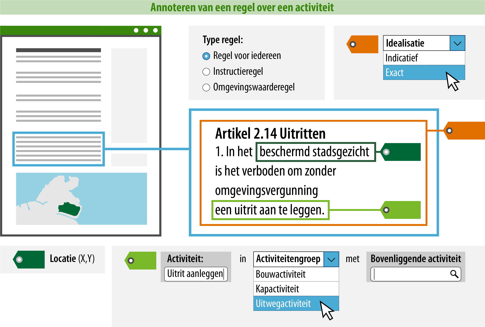

#### Wat kun je nog meer doen om de regel goed vindbaar en zichtbaar te maken?

Je kunt ervoor zorgen dat een raadpleger over meer informatie beschikt tijdens
het oriënteren middels ‘Regels op de kaart’. Door de activiteit te
annoteren, kan deze gepresenteerd worden op de kaart en is het mogelijk om te
zoeken en te filteren op trefwoorden of categorieën.  
In onderstaand voorbeeld is uitgewerkt welke informatie hiervoor geannoteerd
**moet** worden.

>   **4. Naam: geef de activiteit een naam.**  
>   Dit is de naam van de activiteit waar de regel over gaat. Je
>   bent vrij in de keuze van de naam van de activiteit. De naam van de activiteit kan
>   letterlijk in de regel terug te vinden zijn (expliciet), maar het is ook mogelijk
>   de de activiteit impliciet wordt gedefinieerd in de tekst van de regel. Zie hieronder
>   enkele voorbeelden. De naam moet uniek zijn binnen het plan, echter het kan wel voorkomen 
>   dat het dezelfde naam is als een activiteit van een ander bevoegd gezag. De naam van 
>   de activiteit mag dezelfde zijn als de naam van de hierna (onder 5) genoemde activiteitengroep.
>   Hieronder volgen voorbeelden met toelichting:

>   *- Artikel X: het lozen van afvalstoffen is een milieubelastende activiteit.*

>   *- Artikel Y: afvalstoffen mogen niet binnen 30 meter van een waterzuiveringsinstallatie geloosd worden.* 

>   *- Artikel Z: Binnen 30 meter van een waterzuiveringsinstallatie mag niet geloosd worden.*

>   Alle artikelen hebben de activiteit ‘lozen van afvalstoffen’ in zich. In Artikel X staat 
>   deze activiteit expliciet in de tekst, in artikel Y en Z staat deze er impliciet in. 
>   Door artikel Y en Z zodanig te annoteren dat daaruit het object ‘lozen van afvalstoffen’ 
>   ontstaat, is het mogelijk deze activiteit aan het DSO aan te leveren. Indien gewenst 
>   kunnen er toepasbare regels voor gemaakt worden.

>   De naam van de activiteit die wordt geannoteerd, zal in het DSO ook de naam zijn waarop
>   gezocht en gefilterd kan worden. Hier moet bij de naamgeving rekening mee gehouden worden.
>   Daarom wordt geadviseerd om een logische en eenduidige naam te annoteren.

>   **5. Activiteitgroep: geef aan in welke activiteitgroep deze
>   valt.**  
>   Hier geef je aan in welke activiteitgroep de activiteit valt. De
>   activiteitgroep kies je uit een gesloten waardelijst. Dit betekent dat
>   er een vastgestelde lijst is van activiteitgroepen die je kunt kiezen.
>   De mogelijke activiteitgroepen vind je in de
>   [stelselcatalogus](https://stelselcatalogus.omgevingswet.overheid.nl/waardelijstenpagina).
>   De lijst van mogelijke activiteitgroepen zal uiteindelijk geïntergreerd
>   zijn in de planmaaksoftware.

>   Voor de presentatie in een kaartbeeld is de activiteitgroep bepalend.
>   Het attribuut groep bepaalt namelijk met welke symboliek (kleur/arcering) de
>   locatie waar de regel over een activiteit geldig is, in een kaartbeeld wordt
>   weergegeven. De activiteitgroep staat in de symbolisatietabel waaraan
>   een symbolisatie is gekoppeld, deze symbolisatie wordt op de kaart als
>   verbeelding van de activiteit getoond. 

>   Het is mogelijk om de standaard presentatie toe te laten passen, maar je
>   kunt ook kiezen voor een afwijkende presentatie. Meer informatie over de
>   presentatie in kaartbeeld vind je op de pagina [Presenteren](/presenteren)
>   in deze wegwijzer. Indien je wil afwijken van de symbolisatie
>   van de activiteitgroep, is het ook mogelijk om te verbeelden op de 
>   naam van de activiteit. De standaard verbeelding van de activiteitengroep 
>   wordt dan niet getoond in de publicatieportalen. In de DSO viewer krijgt 
>   de raadpleger de keuze een regelingspecifieke verbeelding te zien in plaats 
>   van de standaard verbeelding.

>   Wanneer een activiteit in meerdere groepen past, is het aan het bevoegd gezag 
>   om te kiezen voor de activiteitgroep waarop gefilterd kan worden en waarop (bij 
>   standaard verbeelding) verbeeld wordt. Zoals hiervoor aangegeven kan er 
>   alsnog van de verbeelding afgeweken worden.

>   **6. Bovenliggende activiteit: Geef aan onder welke bovenliggende activiteit deze valt.**  
>   Met dit attribuut wordt aangegeven hoe deze activiteit, zich verhoudt tot een meer generieke 
>   activiteit. Het attribuut bovenliggende activiteit is ingesteld ten behoeve van het opstellen 
>   en gebruiken van vragenbomen. Door de bovenliggende activiteit aan te geven, komt deze
>   relatie (hiërarchisch) in de [functionele structuur](https://pre.omgevingswet.overheid.nl/registratie-toepasbare-regels/) 
>   terecht.  De verwijzing is altijd een verwijzing naar de identificatie van de activiteit én niet naar diens naam. 
>   De bovenliggende activiteit kan een activiteit zijn die door een ander besluit 
>   (ook van een andere bestuurslaag) is vastgesteld. De hoogste bovenliggende activiteit is 
>   *Activiteiten met gevolgen voor de fysieke leefomgeving*. Meer over toepasbare regels en de 
>   functionele structuur vind je op de pagina over [activiteit en toepasbare regels](https://wegwijzerstoptpod.nl/hoe-maak-ik-een-regel-over-een-activiteit/activiteit-en-toepasbare-regels). 

>   In het geval van een de activiteit 'uitrit aanleggen' waarover regels in een omgevingsplan gesteld worden,
>   is het meest logische om te kiezen voor de bovenliggende activiteit 'omgevingsplanactiviteit', 
>   vastgesteld en aangeleverd door het Ministerie van BZK. Een ander voorbeeld is de activiteit 
>   ‘het opslaan van motorbrandstoffen’ die een specificatie is van de generieke, in
>   de Omgevingswet benoemde, activiteit ‘milieubelastende activiteit’.
