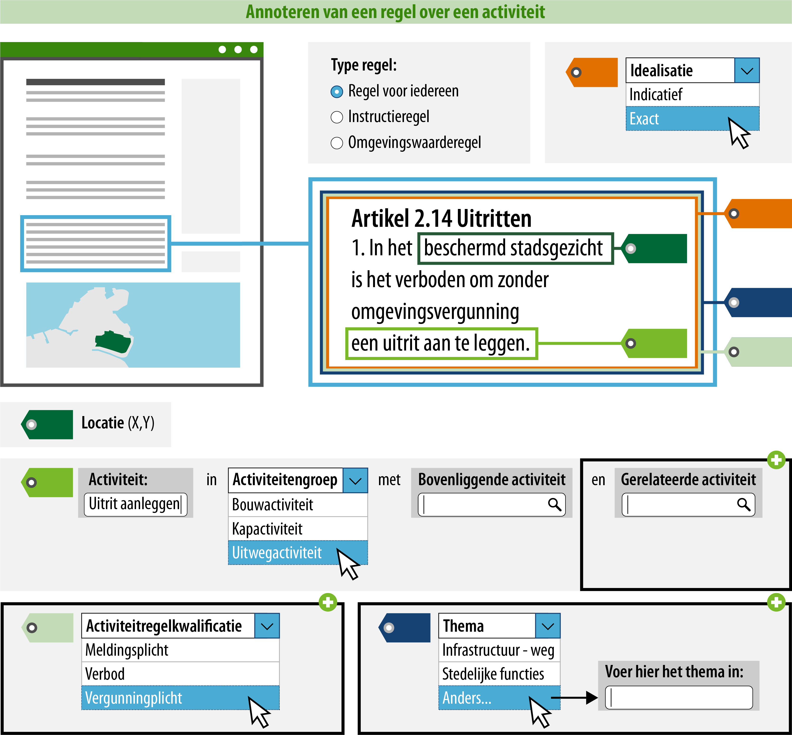

#### Wat kun je allemaal nog meer doen?

Een raadpleger kan zich, met behulp van de acties uit 1 t/m 6, oriënteren in de
‘Regels op de kaart’. Hij  kan filteren op activiteiten, kan op zijn locatie zien
welke regels er van toepassing zijn en kan de activiteiten terugzien op de kaart. 

Hij kan nog niet makkelijk ontdekken of er voor de activiteit een verbod of 
vergunningplicht geldt. Hij moet hiervoor alle afzonderlijke artikelen doorlezen. 
Om het voor de lezer makkelijker te maken is het mogelijk om aan te geven 
welke activiteitregelkwalificatie (verbod, meldingsplicht, vergunningsplicht, e.d.)
het betreft. Daarnaast is het ook mogelijk om een gerelateerde activiteit, thema of
gerelateerde regeltekst toe te voegen.

>   **7. Activiteitregelkwalificatie: Geef aan welke activiteitregelkwalificatie het betreft.**  
>   Het toevoegen van de activiteitregelkwalificatie heeft effect op het zoeken en filteren in het DSO. 
>   Het is een attribuut van de juridische regel, die wat zegt *over* de activiteit. Het is 
>   dus geen attribuut van de activiteit zelf. De activiteitregelkwalificatie kies je uit de 
>   gesloten waardelijst die in de [stelselcatalogus](https://stelselcatalogus.omgevingswet.overheid.nl/waardelijstenpagina) 
>   te vinden is. Wanneer een initiatiefnemer de gebiedsinfo of regels via 'Regels op de Kaart' raadpleegt, 
>   zal voor de activiteiten op die locatie te zien zijn welke activiteitregelkwalificatie ze hebben. 
>   In het geval van dit voorbeeld is de activiteitregelkwalificatie 'vergunningplicht'. 

>   **8. Gerelateerde activiteit: Geef aan welke activiteit(en) aan deze activiteit gerelateerd zijn**  
>   Door een gerelateerde activiteit toe te voegen kan je voor de raadpleger aangeven dat de regels 
>   over de andere activiteit wellicht ook van belang zijn.
>   Een voorbeeld is de activiteit ‘tanken van brandstof’ die een sterke relatie heeft met de activiteit 
>   ‘opslaan van brandstof’ omdat ze altijd samen zullen voorkomen. De gerelateerde activiteit mag een
>   activiteit zijn die door een ander besluit (eventueel door een andere bestuurslaag) is vastgesteld.
>   De verwijzing is altijd een verwijzing naar de identificatie van de activiteit en niet naar de naam. 

>   **9. Geef aan welk thema het betreft.**  
>   Het toevoegen van een thema aan de regel heeft effect op het zoeken en
>   filteren in het DSO. Alle bestuurslagen kunnen hun beleid en regels
>   annoteren met een thema, dit is een tekstgebonden attribuut. Dit betekent
>   dat het regels en beleid van alle omgevingsdocumenten doorzoekbaar maakt,
>   maar het geen effect heeft op de presentatie in de kaart. Het thema kun je
>   kiezen uit de open
>   [waardelijst](https://stelselcatalogus.omgevingswet.overheid.nl/waardelijstenpagina)
>   Thema. De open waardelijst is gevuld met waarden waaruit gekozen kan worden.
>   Wanneer een gewenste waarde niet op de lijst voorkomt, kun je zelf een
>   waarde definiëren. Deze waarde wordt niet opgenomen in de waardelijst.

>   **10. Geef aan welke andere regeltekst relevant is in relatie tot deze
>   regeltekst.**  
>   Het is mogelijk om het artikel of lid (=regeltekst) aan een andere
>   regeltekst te relateren. De relatie kan worden gemaakt tussen twee
>   regelteksten binnen hetzelfde omgevingsdocument, maar ook naar een
>   regeltekst van een ander omgevingsdocument (mits deze al bestaat). Het is
>   niet mogelijk om iets over de aard van de relatie vast te leggen. Dit moet
>   duidelijk blijken uit de tekst.

Wil je het voor de initiatiefnemer nog makkelijker maken? Ga dan aan de slag met
[toepasbare regels](https://wegwijzerstoptpod.nl/hoe-maak-ik-een-regel-over-een-activiteit/activiteit-en-toepasbare-regels). 
Om hiermee te kunnen beginnen is het een voorwaarde dat de 
acties 2 tot en met 6 uitgevoerd zijn. Dankzij deze acties en de toepasbare regels,
is het mogelijk voor de initiatiefnemer om de vergunningchecker te gebruiken. 

Bovenstaande stappen geven inzicht in hoe de standaard bedoelt is, de exacte 
werking van de planmaaksoftware kan afwijken.