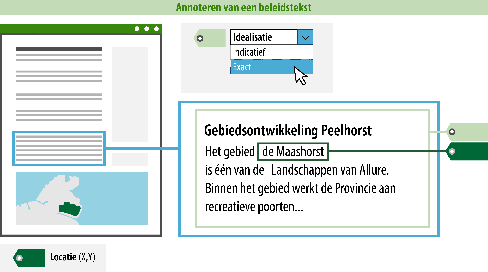

#### Wat moet jij doen?

Een groot deel van de nodige acties wordt door de plansoftware geautomatiseerd. Zo zorgt de plansoftware onder 
andere voor de (controle op) juiste koppeling tussen de IMOW-objecten, dat tekst en kaart verbonden zijn en dat jij
je dus vooral bezig kunt houden met de inhoud. Dat laatste kan de software namelijk niet voor je doen 
of controleren.

Als opsteller van het omgevingsdocument moet je dus aan de slag met:

-   Het opstellen en annoteren van tekst (wat regel ik?);

-   Het koppelen van locaties aan de tekst (waar?).

Voor het annoteren van de tekst is hierna uitgelegd welke gegevens jij moet of
kunt toevoegen. Een deel van de gegevens zit in waardelijsten. De waardelijsten
zijn raadpleegbaar via de [stelselcatalogus
Omgevingswet](https://stelselcatalogus.omgevingswet.overheid.nl/waardelijstenpagina).
De lijst van mogelijke waarden zal uiteindelijk geïntegreerd zijn in de
plansoftware.

Zie hieronder een voorbeeld van een beleidstekst over het gebied 'Maashorst' en
wat jij als opsteller moet aangeven:

*Conceptuele weergave van een minimaal geannoteerde beleidstekst*

>   **1. Locatie: op welke locatie is deze beleidstekst van toepassing?**  
>   Om de raadpleger via het Omgevingsloket van de juiste informatie te voorzien, is
>   het noodzakelijk om aan te geven waar het tekstdeel van toepassing is. Geef
>   hiervoor aan op welke locatie het tekstdeel van toepassing is door de ID van de
>   locatie op te nemen in de machineleesbare tekst. In de plansoftware zal dit bij een koppeling
>   tekst-locatie onder water gebeuren. Je zien geen ID's in de tekst aan de voorkant.

>   De locatie in het voorbeeld is de begrenzing van de Maashorst binnen het gebied Peelhorst.
>   Stel met elkaar goed af waar de grens ligt en leg het gebied Maashorst vast als locatie.
>   Als de locatie aanwezig is dan kunnen de betreffende tekstdelen (beleidsteksten) hieraan gekoppeld
>   worden.

>   **2. Idealisatie: is de begrenzing van de locatie exact of indicatief bedoeld voor dit tekstdeel?**  
>   Als je hebt aangegeven op welke locatie dit tekstdeel van toepassing is, kun je 
>   vervolgens met de idealisatie aangeven of de begrenzing van de locatie voor déze tekst 
>   exact of indicatief geïnterpreteerd moet worden. Dit attribuut zegt dus iets over de begrenzing
>   van de locatie voor dát specifieke tekstdeel. Indicatief kan bijvoorbeeld
>   gebruikt worden wanneer de begrenzing van de locatie bepaald is op basis van
>   een berekening of wanneer een locatie bedoeld is als indicatie of zoekzone
>   voor de plek voor een toekomstige ontwikkeling: pas later wordt de
>   daadwerkelijke plek bepaald. Bij een berekening kan de marge nog aangegeven
>   worden met hoeveel meters er afgeweken kan worden.
>   In het voorbeeld kiezen we voor idealisatie exact, omdat de begrenzing 
>   van de Maashorst zonder marges is vastgesteld.

Dankzij het annoteren van de ‘idealisatie’ en het aangeven van de bijbehorende 
‘locatie’ is precies duidelijk waar het tekstdeel van toepassing is en hoe de locatie in combinatie met
het tekstdeel geïnterpreteerd kan worden. De raadpleger kan nu in het Omgevingsloket op een plek in
de kaart prikken en ziet dan dat een tekstdeel *daar* van toepassing is. Hij moet echter nog steeds wel de inhoudelijke tekst lezen en correct interpreteren om te weten om welke gebiedsaanwijzing het gaat.