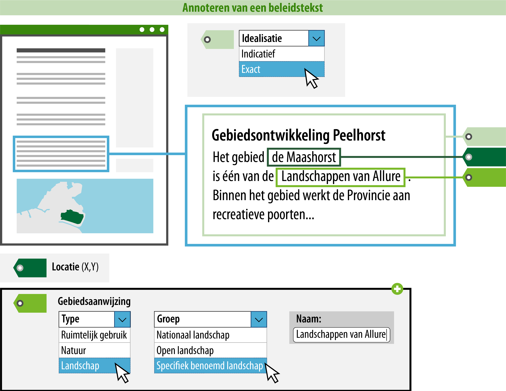

#### Wat kun je nog meer doen om de beleidstekst goed vindbaar en zichtbaar te maken?

Je kunt ervoor zorgen dat een raadpleger over meer informatie beschikt tijdens
het oriënteren in het Omgevingsloket. Door de gebiedsaanwijzing te
annoteren, kan deze gepresenteerd worden op de kaart en is het mogelijk om te
zoeken en te filteren op trefwoorden of categorieën.  
In onderstaand voorbeeld is uitgewerkt welke informatie hiervoor geannoteerd
**moet** worden.

*Conceptuele weergave van een geannoteerde beleidstekst*

>   **3. Type: geef aan van welk type de gebiedsaanwijzing is**  
>   Kies hier om welk type gebiedsaanwijzing het gaat. Er zijn thematische typen
>   gebiedsaanwijzing, zoals bodem, geluid, defensie verkeer, etc. en er zijn drie
>   niet-thematische typen gebiedsaanwijzing, namelijk functie, beperkingengebied en
>   ruimtelijk gebruik. In de TPOD's van omgevingsdocumenten waarin de typen gebiedsaanwijzing gebruikt
>   kunnen worden, worden de werking en het gebruik ervan beschreven. De
>   verschillende typen gebiedsaanwijzing en hun onderliggende groepen met de
>   bijbehorende definities staan ook in [de Stelselcatalogus
>   Omgevingswet](https://stelselcatalogus.omgevingswet.overheid.nl/).

>   Het type gebiedsaanwijzing kies je uit een gesloten waardelijst.
>   Dit betekent dat er een vastgestelde lijst is van typen waaruit je kunt kiezen.
>   De mogelijklijst Er is een beperkte lijst waaruit gekozen kan worden. 
>   De mogelijke typen vind je in de [waardelijst](https://stelselcatalogus.omgevingswet.overheid.nl/waardelijstenpagina).
>   De lijst van mogelijke typen zal per omgevingsdocument uiteindelijk geïntergreerd
>   zijn in de plansoftware.

>   In dit geval wordt er gekozen voor het type gebiedsaanwijzing 'Landschap'.
>   Dit is echter een algemene term die verder verduidelijkt kan worden door 
>   de groep en een naam op te geven.

>   **4. Groep: geef aan in welke groep de gebiedsaanwijzing valt**  
>   Hier geef je aan in welke groep de gebiedsaanwijzing valt. De groep
>   kies je uit een gesloten waardelijst. In bovenstaand voorbeeld is gekozen 
>   voor de groep 'Specifiek benoemd landschap'.

>   Voor de presentatie in een kaartbeeld is de groep bepalend.
>   Het attribuut groep bepaalt namelijk met welke symboliek (kleur/arcering) de
>   locatie waar het tekstdeel met gebiedsaanwijzing geldig is, in een kaartbeeld wordt
>   weergegeven. De groep staat in de symbolisatietabel waaraan
>   een symbolisatie is gekoppeld. Deze symbolisatie wordt op de kaart als
>   verbeelding van de gebiedsaanwijzing getoond.

>   Het is mogelijk om de standaard presentatie toe te laten passen, maar je
>   kunt ook kiezen voor een afwijkende presentatie. Meer informatie over de
>   presentatie in kaartbeeld vind je op de pagina [Presenteren](/presenteren)
>   in deze wegwijzer.

>   Wanneer een gebiedsaanwijzing in meerdere groepen past, is het aan het bevoegd gezag 
>   om te kiezen voor de groep waarop gefilterd kan worden en waarop (bij 
>   standaardverbeelding) verbeeld wordt. Zoals hiervoor aangegeven kan er 
>   alsnog van de verbeelding afgeweken worden.

>   **5. Naam: geef de gebiedsaanwijzing een naam**  
>   Dit is de naam van de specifieke gebiedsaanwijzing waar de regel over gaat. De naam is het meest gedetailleerde niveau waarop
>   je de gebiedsaanwijzing inhoudelijk kunt duiden. Je bent vrij in de keuze van de naam van 
>   de gebiedsaanwijzing. De naam van de gebiedsaanwijzing die wordt geannoteerd, zal in het Omgevingsloket ook de naam zijn waarop 
>   gezocht en gefilterd kan worden. Hier moet bij de naamgeving wel rekening mee gehouden worden, daarom
>   wordt geadviseerd om een logische en eenduidige naam te annoteren.

>   In bovenstaand voorbeeld heet de gebiedsaanwijzing 'Landschappen van Allure'. 
>   Deze gebiedsaanwijzing valt onder het type 'Landschap'. De betekenis volgens de waardelijst:
>   Gebied dat is aangewezen door regels of beleid, gericht op de bescherming en de ontwikkeling 
>   van het landschap vanuit ander perspectief dan natuur en erfgoed. Met dit type kun je hier filteren
>   op landschap.

