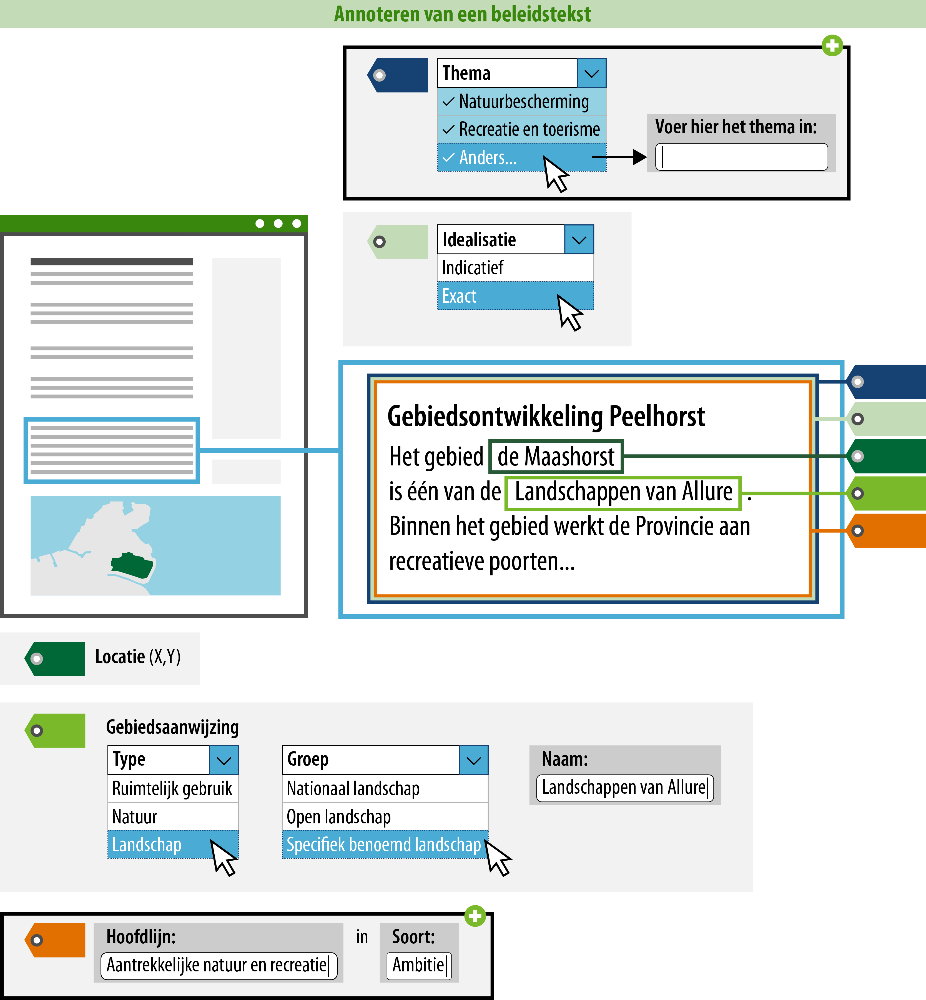

#### Wat kun je allemaal nog meer doen?

Een raadpleger kan zich, met behulp van de acties uit 1 t/m 5, oriënteren in het Omgevingsloket.
Hij kan filteren op gebiedsaanwijzingen, kan op zijn locatie zien
welke beleidsteksten er van toepassing zijn en kan de gebiedsaanwijzingen terugzien op de kaart. 
Daarnaast is het ook nog mogelijk om thema of hoofdlijn toe te voegen.

*Conceptuele weergave van een beleidstekst waarbij zowel de gebiedsaanwijzing als het thema en de hoofdlijn zijn geannoteerd*

>   **6. Geef aan welke hoofdlijn het betreft**  
>   Het toevoegen van een hoofdlijn aan een tekstdeel heeft effect op het zoeken en
>   filteren in het Omgevingsloket. Alle bevoegde gezagen kunnen hun beleidsteksten
>   annoteren met een hoofdlijn. Denk hierbij aan zaken als perspectieven of ambities voor een gebied.

>   In het voorbeeld Maashorst is de hoofdlijn 'Aantrekkelijke natuur en recreatie'. Alles wat te
>   maken heeft met deze ambitie komt onder deze hoofdlijn en is in het Omgevingsloket ook als zodanig vindbaar.
>   De hoofdlijnen kunnen zelf gekozen worden. 

>   **7. Geef aan welk thema het betreft**  
>   Het toevoegen van een thema aan de regel heeft effect op het zoeken en
>   filteren in het DSO. Alle bestuurslagen kunnen hun beleid en regels
>   annoteren met een thema, dit is een tekstgebonden attribuut. Dit betekent
>   dat het regels en beleid van alle omgevingsdocumenten doorzoekbaar maakt,
>   maar het geen effect heeft op de presentatie in de kaart. Het thema kun je
>   kiezen uit een open
>   [waardelijst](https://stelselcatalogus.omgevingswet.overheid.nl/waardelijstenpagina).
>   De open waardelijst is gevuld met waarden waaruit gekozen kan worden.
>   Wanneer een gewenste waarde niet op de lijst voorkomt, kun je zelf een
>   waarde definiëren. Deze waarde wordt niet opgenomen in de waardelijst.

>   Het thema in het voorbeeld Maashorst is nog niet gekozen, omdat er geen dekkende
>   lading is welke voorkomt in de waardelijst. In dit geval geef je een eigen thema op.

Bovenstaande stappen geven inzicht in hoe de standaard bedoeld is en gebruikt kan worden, 
de exacte werking van de plansoftware kan afwijken.