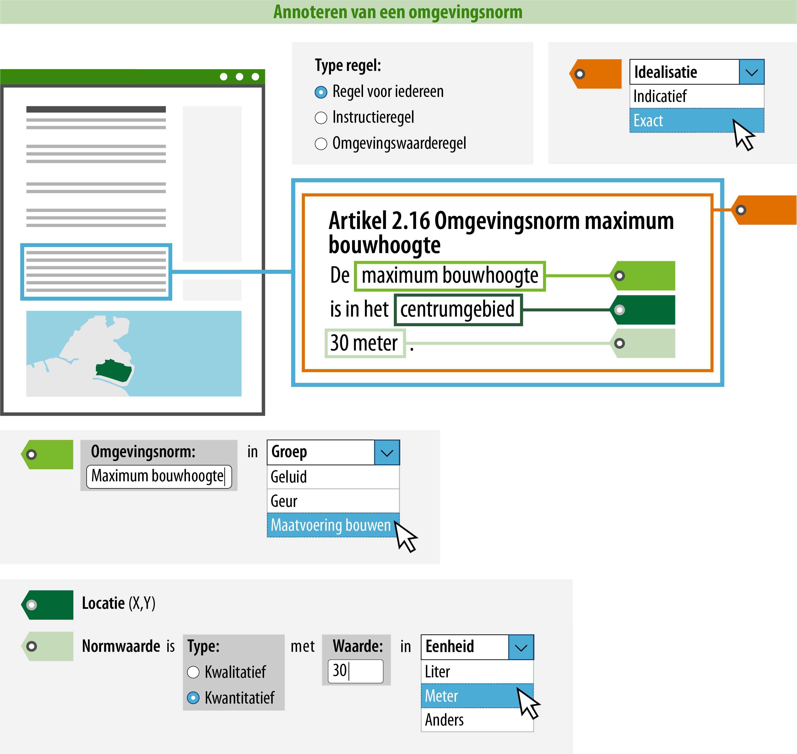
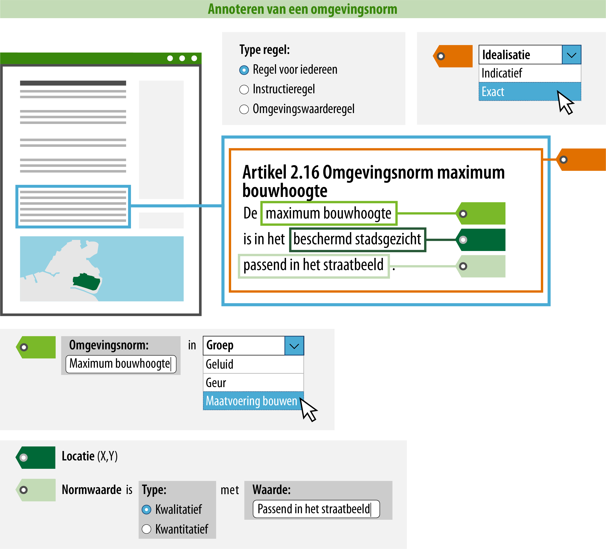
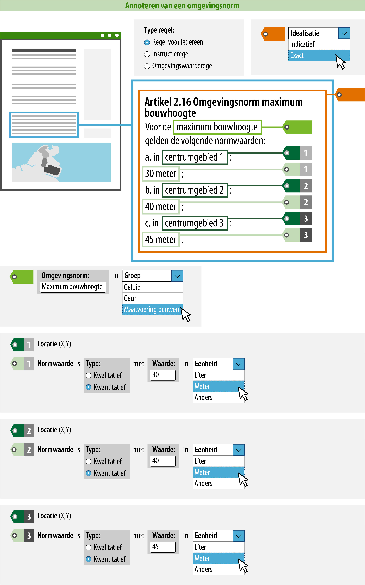

#### Wat is handig om nog meer te doen?

Je kunt ervoor zorgen dat een raadpleger over meer informatie beschikt tijdens
het oriënteren middels ‘Regels op de kaart’. Door de omgevingsnorm te annoteren,
kan deze gepresenteerd worden op de kaart en is het mogelijk om te zoeken en te
filteren op trefwoorden of categorieën.  
In onderstaand voorbeeld is uitgewerkt welke informatie hiervoor geannoteerd
moet worden.

>   **4. Naam: geef de omgevingsnorm een naam.**  
>   Dit is de naam van de omgevingsnorm waar de regel over gaat. Je
>   bent vrij in de keuze van de naam van de omgevingsnorm. De naam van de omgevingsnorm kan
>   letterlijk in de regel terug te vinden zijn (expliciet), maar het is ook mogelijk dat de
>   omgevingsnorm impliciet wordt gedefinieerd in de tekst van de regel.

>   De naam van de omgevingsnorm die wordt geannoteerd, zal in het DSO ook de naam zijn waarop 
>   gezocht en gefilterd kan worden. Hier moet bij de naamgeving rekening mee gehouden worden. Daarom
>   wordt geadviseerd om een logische en eenduidige naam te annoteren.

>   **5. Omgevingsnormgroep: geef aan in welke omgevingsnormgroep deze valt.**  
>   Hier geef je aan in welke omgevingsnormgroep de omgevingsnorm valt. De
>   omgevingsnormgroep kies je uit een gesloten waardelijst. Dit betekent dat er
>   een vastgestelde lijst is van omgevingsnormgroepen die je kunt kiezen. De
>   mogelijke omgevingsnormgroepen vind je in de
>   [stelselcatalogus](https://stelselcatalogus.omgevingswet.overheid.nl/waardelijstenpagina).
>   De lijst van mogelijke omgevingsnormgroepen zal uiteindelijk geïntergreerd
>   zijn in de planmaaksoftware.

>   Voor de presentatie in een kaartbeeld is de omgevingsnormgroep bepalend. Het
>   attribuut groep bepaalt namelijk met welke symboliek (kleur/arcering) de
>   locatie waar de regel geldig is, in een kaartbeeld wordt weergegeven. De
>   omgevingsnormgroep staat in de symbolisatietabel waaraan een symbolisatie is
>   gekoppeld, deze symbolisatie wordt op de kaart als verbeelding van de
>   omgevingsnorm getoond.

>   Het is mogelijk om de standaard presentatie toe te laten passen, maar je
>   kunt ook kiezen voor een afwijkende presentatie. Meer informatie over de
>   presentatie in kaartbeeld vind je op de pagina [Presenteren](/presenteren)
>   in deze wegwijzer.

>   **6. Normwaarde: geef aan of het een kwantitatieve of kwalitatieve
>   normwaarde betreft; en geef de waarde en eventuele eenheid aan.**  
>   In bovenstaand voorbeeld is een kwantitatieve normwaarde van de
>   omgevingsnorm vastgesteld. Hier zul je bij de normwaarde aangeven dat het
>   een kwantitatieve normwaarde betreft en vervolgens de waarde en de eenheid
>   aangeven. De waarde moet numeriek zijn. De eenheid kun je kiezen uit een
>   open waardelijst. Dat betekent dat er een aantal voorgedefinieerde eenheden
>   zijn die je kunt selecteren, maar je kunt ook een zelfgekozen eenheid
>   aangeven. De open waardelijst behorende bij de eenheid kun je inzien in de
>   [stelselcatalogus](https://stelselcatalogus.omgevingswet.overheid.nl/waardelijstenpagina).

>   Het is ook mogelijk om de normwaarde als kwalitatief te annoteren. Dit kun
>   je doen als de normwaarde in woorden is beschreven, zoals in onderstaand voorbeeld.

*Conceptuele weergave van een regel over een omgevingsnorm met een kwalitatief geannoteerde normwaarde*

>   Je kunt de normwaarde ook als kwalitatief annoteren als de normwaarde
>   dermate complex is beschreven waardoor deze niet alleen met een waarde en een eenheid
>   of in een aantal woorden is te beschrijven. In dat geval kunt je in het veld normwaarde verwijzen
>   naar de regeltekst waarin de normwaarde staat, door het veld normwaarde
>   te vullen met de tekst "zie regeltekst". Een voorbeeld hiervan is beschreven op de pagina
>   [Hoe maak ik een omgevingswaarderegel?](/hoe-maak-ik-een-omgevingswaarderegel/opstellen-van-een-omgevingswaarderegel).

>   Bovengenoemde voorbeelden laten zien hoe je een regel over een omgevingsnorm met één normwaarde
>   kunt annoteren. Het is echter ook mogelijk dat in de regel over de omgevingsnorm meerdere locaties
>   met hun bijbehorende normwaarden worden vastgesteld. In zo'n geval is het mogelijk om de
>   verschillende locaties met hun bijbehorende normwaarden in de artikeltekst te beschrijven en
>   die te annoteren. Onderstaande afbeelding geeft dit conceptueel weer.

*Conceptuele weergave van een regel over een omgevingsnorm met meerdere geannoteerde locaties en normwaarden*

>   Als je de raadpleger makkelijker inzicht wil geven in de specifieke normwaarden voor verschillende locaties door
>   middel van interactie met de kaart, dan kun je de locaties met hun bijbehorende normwaarden vastleggen in een
>   geografisch informatieobject. Ook als je voor deze manier kiest, moet je het type regel en de idealisatie
>   aangeven, en de naam en groep van de omgevingsnorm vastleggen. Onderstaande verbeelding laat zien wat jij
>   in dit geval moet doen.

*Conceptuele weergave van een regel over een omgevingsnorm waarbij de locaties en bijbehorende normwaarden in het geografisch informatieobject worden vastgelegd*