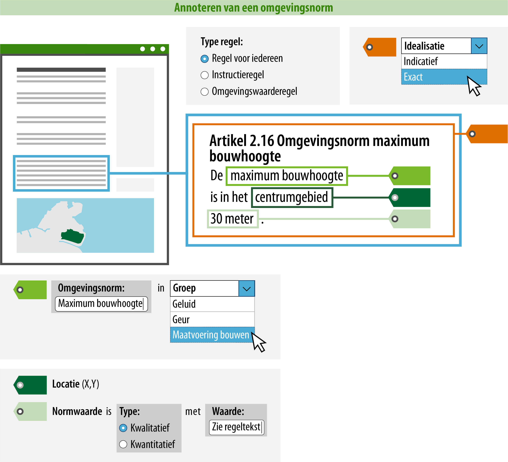
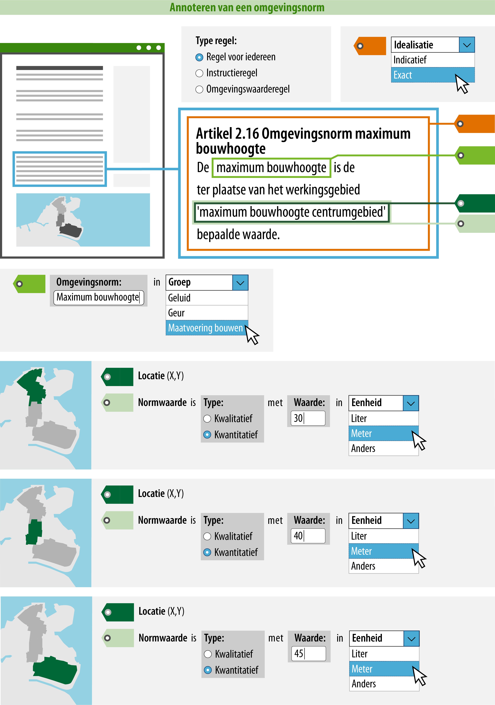

#### Wat is handig om nog meer te doen?

Je kunt ervoor zorgen dat een raadpleger over meer informatie beschikt tijdens
het oriënteren in het Omgevingsloket. Door de omgevingsnorm te annoteren,
kan deze gepresenteerd worden op de kaart en is het mogelijk om te zoeken en te
filteren op trefwoorden of categorieën.  
In onderstaand voorbeeld is uitgewerkt welke informatie hiervoor geannoteerd
moet worden.

*Conceptuele weergave van een regel over een omgevingsnorm met een kwalitatief geannoteerde normwaarde*

>   **4. Naam: geef de omgevingsnorm een naam.**  
>   Dit is de naam van de omgevingsnorm waar de regel over gaat. Je
>   bent vrij in de keuze van de naam van de omgevingsnorm. De naam van de omgevingsnorm kan
>   letterlijk in de regel terug te vinden zijn (expliciet), maar het is ook mogelijk dat de
>   omgevingsnorm impliciet wordt gedefinieerd in de tekst van de regel.

>   De naam van de omgevingsnorm die wordt geannoteerd, zal in het Omgevingsloket ook de naam zijn waarop 
>   gezocht en gefilterd kan worden. Hier moet bij de naamgeving rekening mee gehouden worden. Daarom
>   wordt geadviseerd om een logische en eenduidige naam te annoteren.

>   **5. Omgevingsnormgroep: geef aan in welke omgevingsnormgroep deze valt.**  
>   Hier geef je aan in welke omgevingsnormgroep de omgevingsnorm valt. De
>   omgevingsnormgroep kies je uit een gesloten waardelijst. Dit betekent dat er
>   een vastgestelde lijst is van omgevingsnormgroepen die je kunt kiezen. De
>   mogelijke omgevingsnormgroepen vind je in de
>   [stelselcatalogus](https://stelselcatalogus.omgevingswet.overheid.nl/waardelijstenpagina).
>   De lijst van mogelijke omgevingsnormgroepen zal uiteindelijk geïntergreerd
>   zijn in de planmaaksoftware.

>   Voor de presentatie in een kaartbeeld is de omgevingsnormgroep bepalend. Het
>   attribuut groep bepaalt namelijk met welke symboliek (kleur/arcering) de
>   locatie waar de regel geldig is, in een kaartbeeld wordt weergegeven. De
>   omgevingsnormgroep staat in de symbolisatietabel waaraan een symbolisatie is
>   gekoppeld, deze symbolisatie wordt op de kaart als verbeelding van de
>   omgevingsnorm getoond.

>   Het is mogelijk om de standaard presentatie toe te laten passen, maar je
>   kunt ook kiezen voor een afwijkende presentatie. Meer informatie over de
>   presentatie in kaartbeeld vind je op de pagina [Presenteren](/presenteren)
>   in deze wegwijzer.

>   **6. Normwaarde: geef aan of het een kwalitatieve of kwantitatieve
>   normwaarde betreft; en geef de waarde en eventuele eenheid aan.**  
>   In bovenstaand voorbeeld is de vastgestelde waarde van de normwaarde in woorden 
>   beschreven in het artikel (de regeltekst). Zodra je ervoor kiest om de waarde in de 
>   regeltekst in woorden te beschrijven, kies je bij het annoteren voor een kwalitatieve 
>   normwaarde en verwijs je in het veld waarde naar de regeltekst, door daar 'zie regeltekst' 
>   in te vullen.
>   Door op deze manier te annoteren, zorg je ervoor dat de normwaarde in een kaartbeeld 
>   gepresenteerd kan worden en dat de raadpleger begrijpt dat hij het artikel moet lezen om 
>   te weten welke normwaarde het bevoegd gezag heeft vastgesteld.

>   Bovenstaand voorbeeld laat zien hoe je een regel over een omgevingsnorm met één normwaarde
>   kunt annoteren. Het is echter ook mogelijk dat in de regel over de omgevingsnorm meerdere locaties
>   met hun bijbehorende specifieke normwaarden worden vastgesteld. Als je de raadpleger in dit geval 
>   makkelijker inzicht wil geven in de specifieke normwaarden voor verschillende locaties door
>   middel van interactie met de kaart, dan kun je de locaties met hun bijbehorende normwaarden 
>   vastleggen in een geografisch informatieobject. In de tekst van het artikel kun je dan verwijzen 
>   naar het betreffende informatieobject. Ook als je voor deze manier kiest, moet je het type regel 
>   en de idealisatie aangeven, en de naam en groep van de omgevingsnorm vastleggen. 
>   Onderstaande verbeelding laat zien wat jij in dit geval moet doen.

*Conceptuele weergave van een regel over een omgevingsnorm met meerdere geannoteerde locaties en normwaarden*