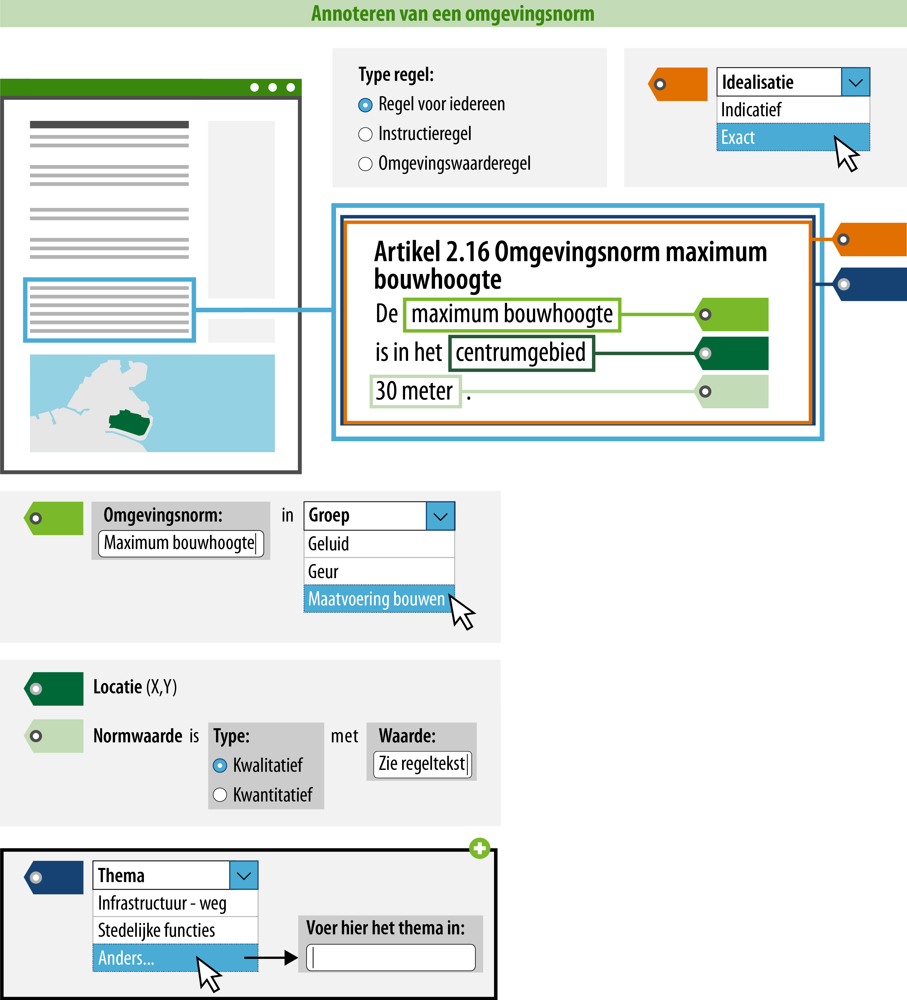

#### Wat kun je allemaal nog meer doen?

Een raadpleger kan zich, met behulp van de acties uit 1 t/m 6, oriënteren in het 
Omgevingsloket. Hij kan filteren op omgevingsnormen, kan op zijn locatie zien welke 
regels er van toepassing zijn en kan de omgevingsnormen terugzien op de kaart 
(gepresenteerd op basis van de omgevingsnormgroep). Tot slot is het ook mogelijk om 
een thema of gerelateerde regeltekst toe te voegen.

*Conceptuele weergave van een regel over een omgevingsnorm waarbij ook het thema is geannoteerd*

>   **7. Geef aan welk thema het betreft.**  
>   Het toevoegen van een thema aan de regel heeft effect op het zoeken en
>   filteren in het Omgevingsloket. Alle bevoegde gezagen kunnen hun beleid en regels
>   annoteren met een thema, dit is een tekstgebonden attribuut. Dit betekent
>   dat het regels en beleid van alle omgevingsdocumenten doorzoekbaar maakt,
>   maar het geen effect heeft op de presentatie in de kaart. Het thema kun je
>   kiezen uit de uitbreidbare
>   [waardelijst](https://stelselcatalogus.omgevingswet.overheid.nl/waardelijstenpagina).
>   De uitbreidbare waardelijst is gevuld met waarden waaruit gekozen kan worden.
>   Wanneer een gewenste waarde niet op de lijst voorkomt, kun je zelf een
>   waarde definiëren. Deze waarde wordt niet opgenomen in de waardelijst.

>   **8. Geef aan welke andere regeltekst relevant is in relatie tot deze
>   regeltekst.**  
>   Het is mogelijk om het artikel of lid (=regeltekst) aan een andere
>   regeltekst te relateren. De relatie kan worden gemaakt tussen twee
>   regelteksten binnen hetzelfde omgevingsdocument, maar ook naar een
>   regeltekst van een ander omgevingsdocument (mits deze al bestaat). Het is
>   niet mogelijk om iets over de aard van de relatie vast te leggen. Dit moet
>   duidelijk blijken uit de tekst.

Als in het artikel regels over een omgevingsnorm worden gesteld in combinatie met regels 
over een activiteit, dan is het mogelijk om ook de activiteit te annoteren.

Je kunt in combinatie met de omgevingsnorm, of in combinatie met de omgevingsnorm én de 
activiteit ook een gebiedsaanwijzing annoteren als dat gewenst is.

Bovenstaande stappen geven inzicht in hoe de standaard bedoeld is, de exacte werking van de plansoftware kan afwijken.

Lees voor meer informatie over hoe je een activiteit en een gebiedsaanwijzing annoteert verder op onderstaande pagina's:

-   [Hoe maak ik een regel over een
    activiteit?](/hoe-maak-ik-een-regel-over-een-activiteit);

-   [Hoe maak ik een gebiedsaanwijzing?](/hoe-maak-ik-een-gebiedsaanwijzing).

Als de regel over de omgevingsnorm in een instructieregel is vastgesteld, moet je daarvoor nog 
een aantal zaken annoteren om die informatie inzichtelijk te maken in het Omgevingsloket. Uitleg over welke gegevens je in dat geval moet of kunt toevoegen, vind je op onderstaande pagina:

-   [Hoe maak ik een instructieregel](/hoe-maak-ik-een-instructieregel) (alleen
    voor rijk en provincie).