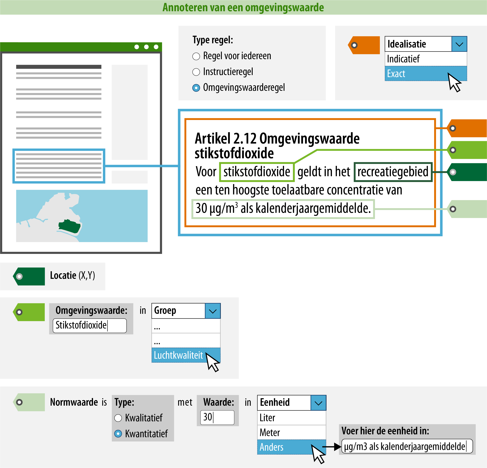
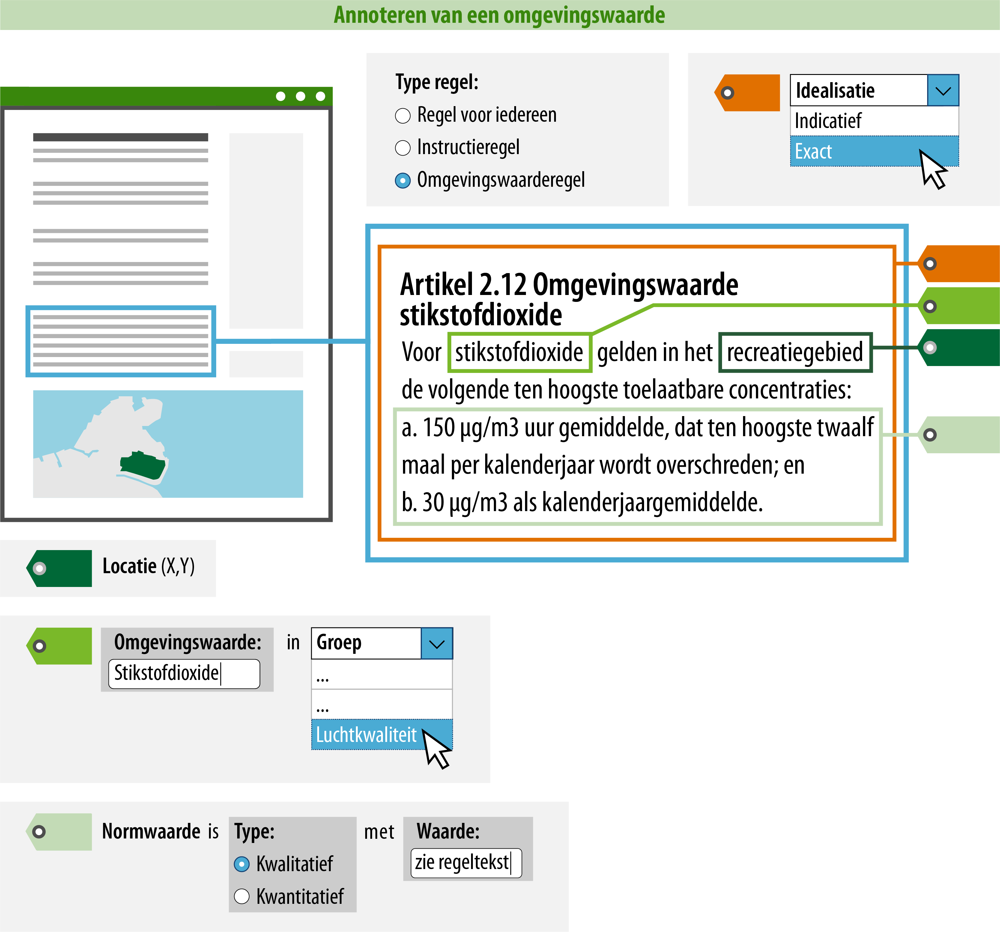

#### Wat kun je nog meer doen om de regel goed vindbaar en zichtbaar te maken?

Je kunt ervoor zorgen dat een raadpleger over meer informatie beschikt tijdens
het oriënteren middels ‘Regels op de kaart’. Door de omgevingswaarde te
annoteren, kan deze gepresenteerd worden op de kaart en is het mogelijk om te
zoeken en te filteren op trefwoorden of categorieën.  
In onderstaand voorbeeld is uitgewerkt welke informatie hiervoor geannoteerd
moet worden.

>   **4. Naam: geef de omgevingswaarde een naam.**  
>   Dit is de naam van de omgevingswaarde waar de regel over gaat. Je
>   bent vrij in de keuze van de naam van de omgevingswaarde. De naam van de omgevingswaarde kan
>   letterlijk in de regel terug te vinden zijn (expliciet), maar het is ook mogelijk dat de 
>   omgevingswaarde impliciet wordt gedefinieerd in de tekst van de regel.

>   De naam van de omgevingswaarde die wordt geannoteerd, zal in het DSO ook de naam zijn waarop 
>   gezocht en gefilterd kan worden. Hier moet bij de naamgeving rekening mee gehouden worden. Daarom
>   wordt geadviseerd om een logische en eenduidige naam te annoteren.

>   **5. Omgevingswaardegroep: geef aan in welke omgevingswaardegroep deze
>   valt.**  
>   Hier geef je aan in welke omgevingswaardegroep de omgevingswaarde valt. De
>   omgevingswaardegroep kies je uit een gesloten waardelijst. Dit betekent dat
>   er een vastgestelde lijst is van omgevingswaardegroepen die je kunt kiezen.
>   De mogelijke omgevingswaardegroepen vind je in de
>   [stelselcatalogus](https://stelselcatalogus.omgevingswet.overheid.nl/waardelijstenpagina).
>   De lijst van mogelijke omgevingswaardegroepen zal uiteindelijk geïntergreerd
>   zijn in de planmaaksoftware.

>   Voor de presentatie in een kaartbeeld is de omgevingswaardegroep bepalend.
>   Het attribuut groep bepaalt namelijk met welke symboliek (kleur/arcering) de
>   locatie waar de omgevingswaarderegel geldig is, in een kaartbeeld wordt
>   weergegeven. De omgevingswaardegroep staat in de symbolisatietabel waaraan
>   een symbolisatie is gekoppeld, deze symbolisatie wordt op de kaart als
>   verbeelding van de omgevingswaarde getoond.

>   Het is mogelijk om de standaard presentatie toe te laten passen, maar je
>   kunt ook kiezen voor een afwijkende presentatie. Meer informatie over de
>   presentatie in kaartbeeld vind je op de pagina [Presenteren](/presenteren)
>   in deze wegwijzer.

>   **6. Normwaarde: geef aan of het een kwantitatieve of kwalitatieve
>   normwaarde betreft; en geef de waarde en eventuele eenheid aan.**  
>   In onderstaand voorbeeld is een kwantitatieve normwaarde van de
>   omgevingswaarde vastgesteld. Hier zul je bij de normwaarde aangeven dat het
>   een kwantitatieve normwaarde betreft en vervolgens de waarde en de eenheid
>   aangeven. De waarde moet numeriek zijn. De eenheid kun je kiezen uit een
>   open waardelijst. Dat betekent dat er een aantal voorgedefinieerde eenheden
>   zijn die je kunt selecteren, maar je kunt ook een zelfgekozen eenheid
>   aangeven. De open waardelijst behorende bij de eenheid kun je inzien in de
>   [stelselcatalogus](https://stelselcatalogus.omgevingswet.overheid.nl/waardelijstenpagina).

>   Het is ook mogelijk om de normwaarde als kwalitatief te annoteren. Dit kun je
>   doen als de normwaarde in woorden is beschreven of als de normwaarde dermate
>   complex is waardoor deze niet alleen met een waarde en een eenheid is te
>   beschrijven. Onderstaande afbeelding geeft zo’n voorbeeld weer. In dit geval is
>   het daarom logisch om de normwaarde als een kwalitatieve waarde te annoteren,
>   waarbij je het veld waarde gebruikt om te verwijzen naar de regeltekst waarin de
>   normwaarde in woorden is beschreven. In het veld waarde vul je dan “zie
>   regeltekst” in.

