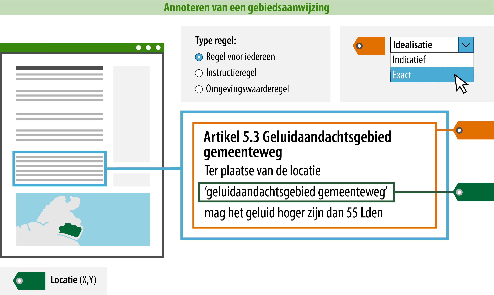

#### Wat moet jij doen?

Een groot deel van de nodige acties wordt door de plansoftware geautomatiseerd. Zo zorgt de plansoftware onder 
andere voor de (controle op) juiste koppeling tussen de IMOW-objecten, dat tekst en kaart verbonden zijn en dat jij
je dus vooral bezig kunt houden met de inhoud. Dat laatste kan de software namelijk niet voor je doen 
of controleren. 

Als opsteller van het omgevingsdocument moet je dus aan de slag met:

-   Het opstellen en annoteren van tekst (wat regel ik?);

-   Het koppelen van de tekst aan locaties (waar?).

Voor het annoteren van de tekst is hierna uitgelegd welke gegevens jij moet of nog kunt toevoegen. Een deel van de
gegevens zit in waardelijsten. De waardelijsten zijn raadpleegbaar via de [stelselcatalogus
Omgevingswet](https://stelselcatalogus.omgevingswet.overheid.nl/waardelijstenpagina). 
De lijst van mogelijke waarden zal uiteindelijk geïntegreerd zijn in de plansoftware.

Zie hieronder een voorbeeld van een artikel uit een omgevingsplan met gebiedsaanwijzing geluidaandachtsgebied 
en wat jij als opsteller ten eerste moet aangeven:

*Conceptuele weergave annoteren van een regel met gebiedsaanwijzing geluidaandachtgebied gemeenteweg*

>   **1. Type regel: om welk type regel gaat het en aan wie is het gericht?**  
>   Er bestaan drie typen regels die je kunt kiezen: een regel voor iedereen,
>   een instructieregel of een omgevingswaarderegel. Een regel met een gebiedsaanwijzing kan een
>   instructieregel of een regel voor iedereen zijn. Het type omgevingswaarderegel kan alleen gebruikt worden wanneer 
>   de regel over een omgevingswaarde gaat; dan kan alleen de inhoudelijke annotatie omgevingswaarde gebruikt worden 
>   en niet een gebiedsaanwijzing. Voor een regel die je wilt annoteren met een gebiedsaanwijzingtype kun je dus alleen 
>   kiezen uit regel voor iedereen en instructieregel. Zoals dit voorbeeld aangeeft, is
>   het artikel over geluidsaandachtsgebieden van het type 'regel voor iedereen'. 
>   Alle regels binnen een artikel moeten van hetzelfde type zijn. 

>   **2. Locatie: op welke locatie is deze regel van toepassing?**  
>   Om de raadpleger via het Omgevingsloket van de juiste informatie te voorzien, is het noodzakelijk om aan te geven 
>   waar de regel van toepassing is. Geef hiervoor aan op welke locatie de regel van toepassing is door de ID van 
>   de locatie op te nemen in de machineleesbare tekst. In de plansoftware zal dit bij een koppeling tekst-locatie 
>   onder water gebeuren. Je ziet geen ID's in de tekst aan de voorkant.

>   **3. Idealisatie: is de begrenzing van de locatie exact of indicatief bedoeld voor deze regel?**
>   Als je hebt aangegeven op welke locatie deze regel van toepassing is, kun je vervolgens met de idealisatie 
>   aangeven of de begrenzing van de locatie voor déze regel exact of indicatief geïnterpreteerd moet worden. 
>   Dit attribuut zegt dus iets over de begrenzing van de locatie voor díe specifieke regel. De reden
>   hiervoor is dat de idealisatie een attribuut is van de juridische regel en niet van de locatie. Indicatief wil 
>   alleen zeggen dat er naast de exacte grens ook nog een marge bestaat. In het geval van een regel in een omgevingsplan
>   die geannoteerd wordt met een gebiedsaanwijzing zal doorgaans voor een exacte idealidatie gekozen worden.

Dankzij het annoteren van de ‘idealisatie’ en het aangeven van de bijbehorende ‘locatie’ is precies duidelijk waar de regel van toepassing is en hoe de locatie in combinatie met de tekst geïnterpreteerd kan worden. De raadpleger
kan nu in het Omgevingsloket op een plek in de kaart prikken en ziet dan het artikel *daar* van toepassing is 
en weet dankzij het type regel ook dat de regel voor *hem* van toepassing is. Hij moet echter nog steeds wel de
inhoudelijke tekst lezen en correct interpreteren om te weten om welke gebiedsaanwijzing het gaat.